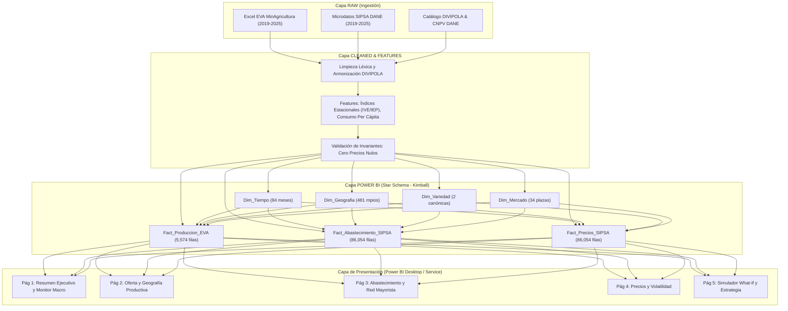
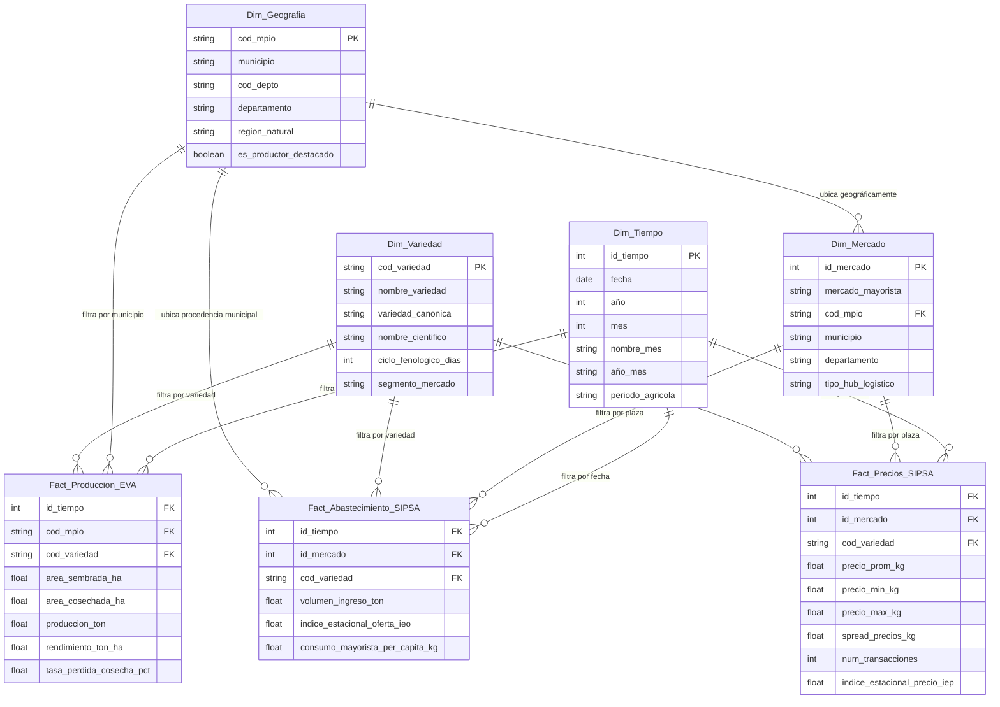

# Especificación de Arquitectura y Modelo Dimensional de Power BI
**Proyecto:** Plataforma Analítica Agropecuaria Colombia — Mercado de la Papa (2019–2025)  
**Fase PDCO:** PLAN → DEVELOPMENT | **SDLC Stage:** Design & Data Engineering  
**Estándar:** DAMA-BOK v2 (Cap. 10: Data Warehousing & Business Intelligence) | SWEBOK v3  
**Versión:** 1.0.0 | **Fecha:** Octubre 2026  

---

## 1. Visión General y Propósito

El presente documento formaliza la arquitectura dimensional en estrella (*Kimball Star Schema*) desarrollada para el consumo analítico en **Power BI Desktop**, **Power BI Service** y **Microsoft Fabric**. Integra de forma armónica y conformada tres fuentes heterogéneas:
1. **Evaluaciones Agropecuarias Municipales (EVA / MinAgricultura / UPRA):** Producción, rendimientos y áreas agrícolas semestrales-municipales.
2. **Sistema de Información de Precios y Abastecimiento del Sector Agropecuario (SIPSA / DANE):** Dinámica transaccional mensual de volúmenes mayoristas y cotizaciones de precios en plazas de mercado.
3. **Censo Nacional de Población y Vivienda (CNPV / DANE):** Proyecciones demográficas nacionales y per cápita.

---

## 2. Diagrama de Arquitectura de Datos y Pipeline ETL

---

## 3. Diagrama Entidad-Relación Dimensional (Mermaid ERD)

---

## 4. Matriz Bus de Arquitectura Dimensional (Grano y Conformance)

| Tabla de Hechos | Grano del Registro | Dim_Tiempo | Dim_Geografia | Dim_Variedad | Dim_Mercado |
| :--- | :--- | :---: | :---: | :---: | :---: |
| **`Fact_Produccion_EVA`** | Municipio - Semestre - Variedad | **X** (Semestral) | **X** (Municipio) | **X** | - |
| **`Fact_Abastecimiento_SIPSA`** | Mercado - Mes - Variedad | **X** (Mensual) | Mediante Dim_Mercado | **X** | **X** |
| **`Fact_Precios_SIPSA`** | Mercado - Mes - Variedad | **X** (Mensual) | Mediante Dim_Mercado | **X** | **X** |

---

## 5. Decisiones de Diseño e Ingeniería de Software

### ADR-003: Esquema en Estrella Desacoplado vs. Tabla Ancha Desnormalizada
- **Contexto:** Las fuentes EVA y SIPSA presentan naturalezas de reporte y granos temporales distintos (semestral agrícola vs. transaccional mayorista mensual).
- **Decisión:** Implementar un esquema Kimball multitable con dimensiones compartidas (*conformed dimensions*) en lugar de un único dataframe plano desnormalizado.
- **Consecuencias Positivas:**
  1. Rendimiento óptimo en el motor tabular VertiPaq de Power BI gracias a la compresión por diccionario.
  2. Evita la duplicación masiva de datos y errores de agregación (problema de doble conteo o *fan-out traps*).
  3. Escalabilidad inmediata para añadir nuevas dimensiones (clima, insumos, comercio exterior).

### ADR-004: Separación de Hechos de Abastecimiento y Hechos de Precios
- **Contexto:** Aunque SIPSA contiene volumen y precio en el mismo reporte, las operaciones analíticas sobre precios requieren ponderaciones y cálculos no aditivos (medias, percentiles, spreads), mientras que los volúmenes son aditivos directos.
- **Decisión:** Desacoplar `Fact_Abastecimiento_SIPSA` y `Fact_Precios_SIPSA` manteniendo claves idénticas.
- **Consecuencias:** Claridad de modelado, medidas DAX más legibles y optimización de memoria.

---

## 6. Validación de Principios SOLID
- **Single Responsibility (SRP):** El módulo `PowerBIExportService` tiene como única responsabilidad transformar y serializar los datasets limpios al formato dimensional de BI.
- **Open/Closed (OCP):** Nuevas dimensiones pueden ser incorporadas sin alterar los métodos constructores existentes de hechos.
- **Dependency Inversion (DIP):** Las rutas de entrada y salida se desacoplan mediante la configuración global de `src/infrastructure/config.py`.
