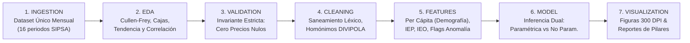

# Repositorio Documental Maestro del Proyecto

**Proyecto**: Plataforma Analítica del Mercado de la Papa en Colombia (SIPSA 2019–2025)  
**Marco de Trabajo**: Metodología CRISP-DM & Marco PDCO (Plan, Development, Control, Operations)  
**Estándares**: SWEBOK v3, DAMA-BOK v2, IEEE 830 / ISO 29148, ISO/IEC 25010, Clean Architecture, PEP 8  

---

## 1. Estructura General de Carpetas Documentales

La documentación del proyecto se organiza en dos grandes compendios especializados:

```
docs/
├── README.md                           ← [Este archivo] Índice maestro de navegación
│
├── documentos_PDCO/                    ← DOCUMENTACIÓN FORMAL DE INGENIERÍA Y CICLO DE VIDA (CRISP-DM / SDLC)
│   ├── requirements.md                 ← Especificación formal de requerimientos (IEEE 830 / ISO 29148)
│   ├── architecture.md                 ← Arquitectura de Software y Datos (Clean Architecture + 7 etapas CRISP-DM)
│   └── development_plan.md             ← Plan de desarrollo detallado, cronograma e hitos por etapas
│
└── documentos_tecnicos_estadisticos/   ← DOCUMENTACIÓN METODOLÓGICA, ESTADÍSTICA Y GOBERNANZA DE DATOS
    ├── README.md                       ← Índice del compendio técnico-estadístico
    ├── proposito.md                    ← Definición estratégica y los 3 pilares (Oferta, Demanda, Precios)
    ├── bateriapreguntas.md             ← 24 preguntas de investigación orientadoras
    ├── ficha_metodologica.md           ← Fichas técnicas de Demanda Aparente, Per Cápita, IEO e IEP
    ├── manual_granularidad.md          ← 5 escalas temporales, fenología agronómica y jerarquía espacial
    ├── bateriaindicadores.md           ← Catálogo de 18 KPIs con estimadores duales
    ├── diagrama_como.md                ← Diagramas de flujo analítico y formación de precios en Mermaid
    ├── taxonomia_datos.md              ← Taxonomía jerárquica de variables y variedades comerciales
    ├── catalogo_divipola.md            ← Catálogo oficial DIVIPOLA DANE (33 departamentos y cuencas paperas)
    ├── plan_extraccion_demografia.md   ← Plan de extracción y desagregación DANE PPED 2019-2025
    ├── bateria_datos_crudos.md         ← Inventario, perfilamiento de 16 periodos y schema drift
    ├── manual_wrangling_gobernanza.md  ← Guía de limpieza léxica, pivoteo y principios DAMA-BOK
    ├── manual_anomalias.md             ← Protocolos de detección de outliers (IQR, MAD, Isolation Forest)
    └── bateria_pruebas_estadisticas.md ← Cullen & Frey, Kruskal-Wallis, Levene, Welch, ANOVA y Bootstrap BCa
```

---

## 2. Acceso Directo a los Documentos de Ingeniería (documentos_PDCO)

| Documento | Enfoque | Contenido Principal |
|:---|:---|:---|
| [docs/documentos_PDCO/requirements.md](file:///c:/Users/ADAN/OneDrive/Documentos/analisispapamercadoorlando/docs/documentos_PDCO/requirements.md) | Requerimientos Formales (SRS) | 23 requerimientos funcionales y 6 no funcionales organizados en las 7 etapas CRISP-DM. Regla estricta: ningún precio nulo. Dataset único SIPSA mensual. |
| [docs/documentos_PDCO/architecture.md](file:///c:/Users/ADAN/OneDrive/Documentos/analisispapamercadoorlando/docs/documentos_PDCO/architecture.md) | Arquitectura del Sistema (SAD) | Clean Architecture (Dominio, Aplicación, Infraestructura, Presentación) + Pipeline Medallion en `data/` (RAW $\rightarrow$ CLEANED $\rightarrow$ FEATURES $\rightarrow$ CURATED) + Módulos `src/` y 7 cuadernos Jupyter. |
| [docs/documentos_PDCO/development_plan.md](file:///c:/Users/ADAN/OneDrive/Documentos/analisispapamercadoorlando/docs/documentos_PDCO/development_plan.md) | Plan de Desarrollo | Cronograma detallado de 8 días hábiles, hitos de implementación por cada etapa CRISP-DM, especificación de notebooks con `%pip install` y criterios DoD. |

---

## 3. Matriz Metodológica CRISP-DM de las 7 Etapas


