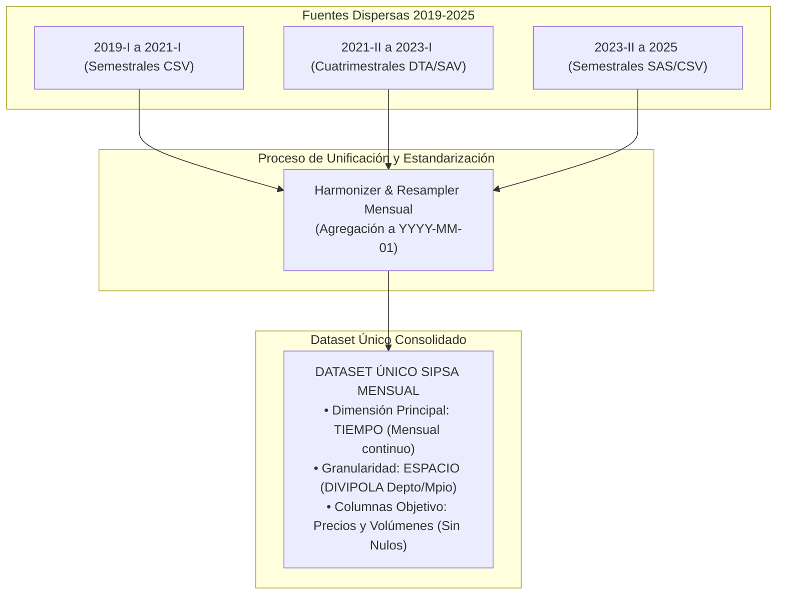
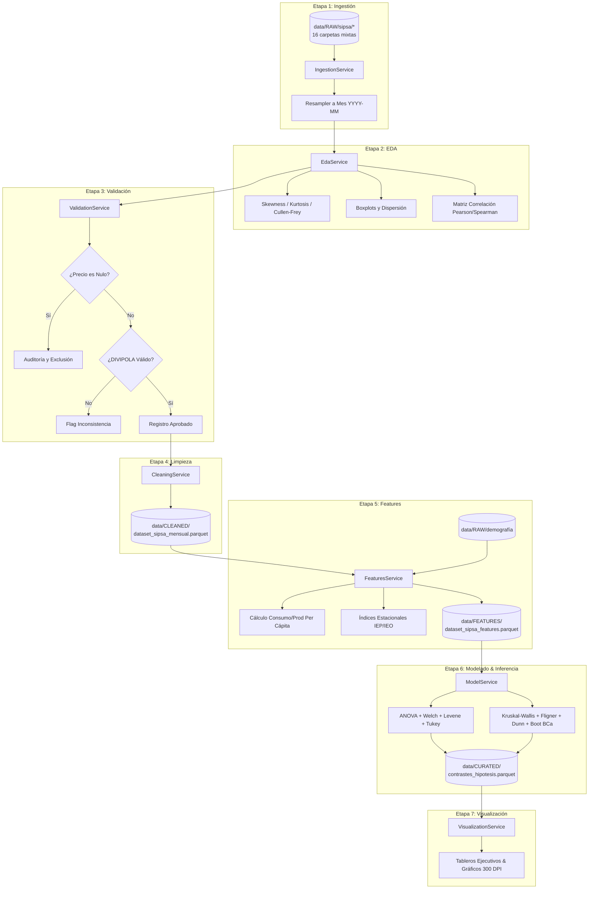

# Documento de Arquitectura de Software y Ciencia de Datos (SAD)

**Proyecto**: Plataforma Analítica del Mercado de la Papa en Colombia (SIPSA 2019–2025)  
**Marco Metodológico**: CRISP-DM & Marco PDCO (PLAN $\rightarrow$ DEVELOPMENT)  
**Estilo Arquitectónico**: Clean Architecture (Robert C. Martin) + Pipeline por Etapas CRISP-DM + Medallion Data Storage  
**Estándares Normativos**: SWEBOK v3 (Cap. 2), DAMA-BOK v2, ISO/IEC 25010, SOLID, PEP 8  
**Ubicación**: [docs/documentos_PDCO/architecture.md](file:///c:/Users/ADAN/OneDrive/Documentos/analisispapamercadoorlando/docs/documentos_PDCO/architecture.md)  
**Versión**: 2.0.0 | **Fecha**: 2026-10-06  

---

## 1. Visión General: Convergencia de CRISP-DM y Clean Architecture

La arquitectura del sistema fusiona el ciclo de vida de minería de datos **CRISP-DM** con los principios de desacoplamiento de **Clean Architecture**, estructurando el flujo en **7 etapas maestras**:

```
┌──────────────────────────────────────────────────────────────────────────────────┐
│             PIPELINE DE 7 ETAPAS CRISP-DM SOBRE ARQUITECTURA LIMPIA              │
├────────────┬──────────┬────────────┬──────────┬────────────┬──────────┬──────────────┤
│ 1.INGESTION│  2. EDA  │3.VALIDATION│4.CLEANING│ 5.FEATURES │ 6. MODEL │7.VISUALIZAT. │
│ Lector     │Medidas   │Regla de Oro│Saneamiento│Métricas   │Inferencia│Renderizado   │
│ Políglota  │Forma,    │Invariante: │Léxico,   │Per Cápita, │Dual:     │300 DPI:      │
│ Dataset    │Cullen &  │Ningún      │Filtros   │IEP, IEO,   │Paramétrica│Cajas,        │
│ Único      │Frey, Box,│Precio Nulo │DIVIPOLA  │Panel       │No Param. │Densidad,     │
│ Mensual    │Correlac. │(NotNull)   │DAMA-BOK  │Mensual     │Bootstrap │Correlación   │
└────────────┴──────────┴────────────┴──────────┴────────────┴──────────┴──────────────┘
```

La separación de responsabilidades se garantiza mediante 4 capas concéntricas:
1. **Dominio (`src/domain/`)**: Entidades analíticas puras, validaciones invariantes (ej. regla de precios no nulos) y fórmulas estadísticas base sin dependencias externas.
2. **Aplicación (`src/application/`)**: Casos de uso divididos rigurosamente según las 7 etapas CRISP-DM.
3. **Infraestructura (`src/infrastructure/`)**: Lectores de formatos dispares (`.csv`, `.dta`, `.sav`, `.sas`), serializadores Parquet optimizados y configuración global.
4. **Presentación y Cuadernos (`src/presentation/` & `notebooks/`)**: Renderizadores gráficos en `seaborn` y `matplotlib`, y cuadernos Jupyter `.ipynb` autocontenidos con instalación `%pip install` en cabecera.

---

## 2. Arquitectura del Dataset Único Nacional SIPSA (Dimensionalidad y Granularidad)

El sistema centraliza las operaciones de análisis en un **único dataset maestro** consolidado:

```
data/CLEANED/dataset_sipsa_mensual_nacional.parquet  (Capa Intermedia Saneada)
data/FEATURES/dataset_sipsa_panel_features.parquet   (Capa con Métricas y Per Cápita)
```



### 2.1 Especificaciones de la Estructura Dimensional:
* **Dimensión Primaria (Tiempo)**: La granularidad base obligatoria es **MENSUAL**. Todas las transacciones diarias y los cortes de cuatrimestres y semestres se agrupan temporalmente al primer día de cada mes (`fecha_mes = 'YYYY-MM-01'`), garantizando una serie de tiempo continua de 84 meses (2019-01 a 2025-12).
* **Granularidad Secundaria (Espacio)**: Nivel municipal (`divipola_mpio` de 5 dígitos) y departamental (`divipola_depto` de 2 dígitos), complementado por el nodo de mercado mayorista (`mercado_mayorista`).
* **Regla de Invarianza Estricta**: **Ningún precio puede ser nulo** (`precio_prom_kg IS NOT NULL`). En la fase de validación, cualquier registro sin precio verificado es auditado y descartado del panel analítico.

---

## 3. Desglose de Servicios por las 7 Etapas CRISP-DM

### 3.1 Etapa 1: Ingestión (`src/application/ingestion_service.py`)
* Lee políglotamente los 16 periodos crudos en `data/RAW/sipsa/` utilizando el patrón *Factory Method* (`FileReaderFactory`).
* Estandariza la fecha a formato ISO y genera el campo temporal `fecha_mes`.
* Aplica agregación mensual sumando volúmenes (`volumen_ingreso_ton`) y promediando precios ponderados (`precio_prom_kg`).
* Consolida el **dataset único SIPSA nacional**.

### 3.2 Etapa 2: Análisis Exploratorio de Datos — EDA (`src/application/eda_service.py`)
* **Medidas de Tendencia Central**: Media aritmética, media recortada (al 5%), mediana y moda.
* **Medidas de Dispersión**: Varianza, desviación estándar, rango intercuartílico (IQR) y desviación absoluta mediana (MAD).
* **Medidas de Forma**: Coeficiente de asimetría (*Skewness*, $S$) y curtosis de Fisher (*Kurtosis*, $K$).
* **Gráfico de Cullen y Frey**: Mapeo empírico de $S^2$ vs $K$ comparado con las trayectorias teóricas (Normal, Uniforme, Exponencial, Lognormal, Gamma, Weibull).
* **Diagramas de Caja y Bigotes (*Boxplots*)**: Detección visual de variabilidad entre años y mercados.
* **Diagramas de Correlación**: Matrices de Pearson y Spearman entre volúmenes, precios y población.

### 3.3 Etapa 3: Validación (`src/application/validation_service.py`)
* Aplica la regla estricta: `precio_prom_kg > 0` y `precio_prom_kg IS NOT NULL`.
* Verifica la regla física: `precio_min_kg <= precio_prom_kg <= precio_max_kg`.
* Valida códigos territoriales contra el catálogo oficial en [docs/documentos_tecnicos_estadisticos/catalogo_divipola.md](file:///c:/Users/ADAN/OneDrive/Documentos/analisispapamercadoorlando/docs/documentos_tecnicos_estadisticos/catalogo_divipola.md).
* Emite un informe de calidad DAMA-BOK (`validation_report.json`).

### 3.4 Etapa 4: Limpieza y Saneamiento (`src/application/cleaning_service.py`)
* Sanea anomalías léxicas (remoción de acentos, espacios duplicados y caracteres especiales).
* Desambigua códigos homónimos mediante la llave `(divipola_depto, divipola_mpio)`.
* Persiste la capa saneada en `data/CLEANED/dataset_sipsa_mensual_limpio.parquet`.

### 3.5 Etapa 5: Ingeniería de Características (`src/application/features_service.py`)
* Cruza la serie mensual con las proyecciones de población DANE de [docs/documentos_tecnicos_estadisticos/plan_extraccion_demografia.md](file:///c:/Users/ADAN/OneDrive/Documentos/analisispapamercadoorlando/docs/documentos_tecnicos_estadisticos/plan_extraccion_demografia.md).
* Computa el consumo per cápita municipal ($c_{m,t}$ en kg/hab/mes) y la producción departamental ($q_{d,t}$ en ton/hab).
* Calcula el Índice Estacional de Precios (IEP) y el Índice Estacional de Oferta (IEO) mediante descomposición estacional STL.
* Marca etiquetas de valores extremos mediante Tukey IQR y MAD sin modificar los datos crudos.
* Persiste en `data/FEATURES/dataset_sipsa_features.parquet`.

### 3.6 Etapa 6: Inferencia Estadística y Modelado (`src/application/model_service.py`)
* **Canal Paramétrico**: Prueba de homocedasticidad de Levene y Bartlett, ANOVA de un factor, ANOVA de Welch (robusto ante varianzas desiguales), pruebas post-hoc de Tukey HSD y Games-Howell, e intervalos t-Student al 95%.
* **Canal No Paramétrico**: Prueba de Fligner-Killeen, prueba de rangos de Kruskal-Wallis, contrastes post-hoc de Dunn con ajuste FDR (Benjamini-Hochberg), e Intervalos de Confianza Bootstrap BCa (al 95% con $B=2,000$ réplicas).
* Persiste los resultados inferenciales en `data/CURATED/contrastes_estadisticos_anuales.parquet`.

### 3.7 Etapa 7: Visualización y Reportes (`src/application/visualization_service.py`)
* Renderiza figuras de alta resolución (300 DPI):
  1. Mapa de Cullen y Frey ($S^2$ vs $K$).
  2. Gráficos de cajas y bigotes de precios y volúmenes por variedad y mercado.
  3. Mapas de calor de matrices de correlación (Pearson y Spearman).
  4. Curvas de estacionalidad mensual y márgenes interanuales.

---

## 4. Estructura del Código Base (`src/` y `notebooks/`)

```
analisispapamercadoorlando/
├── data/
│   ├── RAW/                       ← Datos originales inmutables (SIPSA y Demografía)
│   ├── CLEANED/                   ← Dataset Único SIPSA Mensual (Parquet)
│   ├── FEATURES/                  ← Tablas con per cápita, IEP, IEO y flags (Parquet)
│   └── CURATED/                   ← Tablas finales de contrastes y KPIs (Parquet/CSV)
│
├── notebooks/                     ← 7 Cuadernos Jupyter correspondientes a las 7 etapas
│   ├── 01_ingestion_dataset_unico.ipynb
│   ├── 02_analisis_exploratorio_eda.ipynb
│   ├── 03_validacion_reglas_negocio.ipynb
│   ├── 04_limpieza_y_gobernanza.ipynb
│   ├── 05_ingenieria_de_features.ipynb
│   ├── 06_modelado_e_inferencia_dual.ipynb
│   └── 07_visualizacion_y_tableros.ipynb
│
├── src/                           ← Paquete de código limpio en Python (PEP 8)
│   ├── __init__.py
│   ├── domain/                    ← CAPA 1: Dominio Puro
│   │   ├── __init__.py
│   │   ├── entities.py            ← Dataclasses (SipsaRecord, MonthlyBucket, MetricResult)
│   │   ├── invariants.py          ← Reglas de oro (PriceNotNullValidator, RangeValidator)
│   │   └── statistics_domain.py   ← Fórmulas puras (Bootstrap BCa, Cullen-Frey)
│   │
│   ├── application/               ← CAPA 2: Servicios por Etapas CRISP-DM
│   │   ├── __init__.py
│   │   ├── ingestion_service.py   ← Etapa 1: Ingestión políglota y unificación
│   │   ├── eda_service.py         ← Etapa 2: Medidas forma/tendencia/dispersión
│   │   ├── validation_service.py  ← Etapa 3: Auditoría y validación
│   │   ├── cleaning_service.py    ← Etapa 4: Saneamiento y tipado
│   │   ├── features_service.py    ← Etapa 5: Per cápita, estacionalidad, lags
│   │   ├── model_service.py       ← Etapa 6: ANOVA, Kruskal, Welch, Bootstrap
│   │   └── visualization_service.py ← Etapa 7: Renderizado de figuras
│   │
│   ├── infrastructure/            ← CAPA 3: E/S y Adaptadores
│   │   ├── __init__.py
│   │   ├── readers/               ← Lectores CSV, DTA, SAV, SAS (Factory)
│   │   ├── writers/               ← Escritura optimizada Parquet
│   │   └── config.py              ← Rutas, constantes y parámetros
│   │
│   └── presentation/              ← CAPA 4: Renderizadores Específicos
│       ├── __init__.py
│       ├── cullen_frey_plotter.py
│       ├── boxplot_plotter.py
│       └── correlation_plotter.py
│
├── tests/                         ← Suite de pruebas unitarias (Pytest)
├── requirements.txt               ← Dependencias fijas del entorno
└── metadata.json                  ← Control y trazabilidad PDCO
```

---

## 5. Estándar de Construcción de Cuadernos Jupyter

Todo cuaderno en `notebooks/` debe iniciar de forma estricta con la celda de instalación idempotente antes de importar librerías:

```python
# ==============================================================================
# CELDA 1 OBLIGATORIA: INSTALACIÓN IDEMPOTENTE DE DEPENDENCIAS EN EL KERNEL
# ==============================================================================
import sys
import subprocess

%pip install --quiet --upgrade pip
%pip install --quiet \
    numpy>=1.24.0 \
    pandas>=2.0.0 \
    scipy>=1.10.0 \
    statsmodels>=0.14.0 \
    scikit-learn>=1.3.0 \
    matplotlib>=3.7.0 \
    seaborn>=0.12.0 \
    openpyxl>=3.1.0 \
    pyreadstat>=1.2.0 \
    fastparquet>=2023.8.0 \
    tabulate>=0.9.0

print(f"Ambiente verificado exitosamente en Python: {sys.version.split()[0]}")
```

---

## 6. Diagrama de Flujo del Pipeline CRISP-DM


