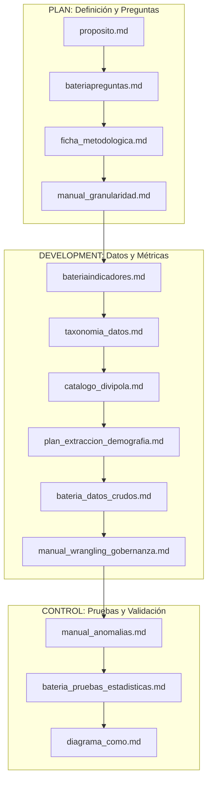

# Índice Maestro de Documentación del Proyecto

**Proyecto**: Análisis Histórico del Mercado de la Papa en Colombia (2019 - 2025)  
**Fuente**: Microdatos Oficiales SIPSA - DANE  
**Marco de Trabajo**: PDCO (Plan, Development, Control, Operations) | DAMA-BOK | SWEBOK  

---

## 1. Estructura General de la Documentación Técnica

La documentación del proyecto se organiza de forma sistemática y modular en la carpeta `docs/`, abarcando desde la definición estratégica del problema hasta los protocolos estadísticos avanzados y de gobernanza de datos:

```
docs/
├── README.md                      ← [Este archivo] Índice maestro y mapa documental
│
├── 1. ESTRATEGIA Y ALCANCE (Fase PLAN)
│   ├── proposito.md               ← Propósito, justificación y los 3 pilares del mercado
│   └── bateriapreguntas.md        ← 24 preguntas orientadoras de investigación
│
├── 2. METODOLOGÍA E INDICADORES (Fase PLAN → DEVELOPMENT)
│   ├── ficha_metodologica.md      ← Fichas técnicas de Demanda Aparente, Población, Consumo per cápita, Estacionalidad y Producción per cápita
│   ├── manual_granularidad.md     ← Manual de granularidad temporal, fenología agronómica y escalas espaciales
│   ├── bateriaindicadores.md      ← Catálogo de 18 KPIs (Oferta, Demanda y Precios con estimadores duales)
│   └── diagrama_como.md           ← Diagramas metodológicos en Mermaid del proceso analítico
│
├── 3. DATOS Y GOBERNANZA (Fase DEVELOPMENT - DAMA-BOK)
│   ├── taxonomia_datos.md         ← Taxonomía jerárquica de variables, variedades de papa y niveles de desagregación
│   ├── catalogo_divipola.md       ← Catálogo maestro DIVIPOLA DANE (33 departamentos, nodos mayoristas y cuencas paperas)
│   ├── plan_extraccion_demografia.md ← Plan de extracción y desagregación demográfica 2019-2025 desde PPED
│   ├── bateria_datos_crudos.md    ← Inventario, perfilamiento y schema drift de SIPSA 2019-2025
│   └── manual_wrangling_gobernanza.md ← Reglas de limpieza, pivoteo, calidad y linaje Medallion
│
└── 4. RIGOR ESTADÍSTICO Y CONTROL (Fase CONTROL)
    ├── bateria_pruebas_estadisticas.md ← Cullen & Frey, Kruskal-Wallis, Levene, ANOVA, Welch, Dunn e IC Bootstrap
    └── manual_anomalias.md        ← Protocolos de detección y tratamiento de outliers
```

---

## 2. Mapa Rápido de Documentos y Enlaces

| # | Documento | Eje Temático Principal | Contenido Clave |
|---|---|---|---|
| 1 | [proposito.md](file:///c:/Users/ADAN/OneDrive/Documentos/analisispapamercadoorlando/docs/proposito.md) | Estrategia y Negocio | Objetivos centrados en: Oferta, Demanda y Precios. |
| 2 | [bateriapreguntas.md](file:///c:/Users/ADAN/OneDrive/Documentos/analisispapamercadoorlando/docs/bateriapreguntas.md) | Investigación | Preguntas clave divididas en los tres módulos de mercado. |
| 3 | [ficha_metodologica.md](file:///c:/Users/ADAN/OneDrive/Documentos/analisispapamercadoorlando/docs/ficha_metodologica.md) | Metodología | Demanda Aparente, Población DANE, Consumo per cápita, Producción per cápita, IEO e IEP. |
| 4 | [manual_granularidad.md](file:///c:/Users/ADAN/OneDrive/Documentos/analisispapamercadoorlando/docs/manual_granularidad.md) | Granularidad | 5 escalas temporales (diario a anual), ciclos fenológicos (180d vs 120d) y jerarquía espacial. |
| 5 | [bateriaindicadores.md](file:///c:/Users/ADAN/OneDrive/Documentos/analisispapamercadoorlando/docs/bateriaindicadores.md) | Métricas y KPIs | Fórmulas matemáticas de volumen, estacionalidad, cuotas, producción/consumo per cápita y estimadores duales. |
| 6 | [diagrama_como.md](file:///c:/Users/ADAN/OneDrive/Documentos/analisispapamercadoorlando/docs/diagrama_como.md) | Procesos y Flujos | Diagramas Mermaid del flujo metodológico integral, doble canal de procesamiento y formación de precios. |
| 7 | [taxonomia_datos.md](file:///c:/Users/ADAN/OneDrive/Documentos/analisispapamercadoorlando/docs/taxonomia_datos.md) | Arquitectura de Información | Jerarquía de variables, dimensiones, variedades de papa y niveles de desagregación. |
| 8 | [catalogo_divipola.md](file:///c:/Users/ADAN/OneDrive/Documentos/analisispapamercadoorlando/docs/catalogo_divipola.md) | Geografía de Referencia | Directorio completo de 33 departamentos, centrales mayoristas y cuencas paperas de Colombia. |
| 9 | [plan_extraccion_demografia.md](file:///c:/Users/ADAN/OneDrive/Documentos/analisispapamercadoorlando/docs/plan_extraccion_demografia.md) | Insumo Demográfico | Protocolo y pipeline ETL para desagregación de proyecciones DANE PPED 2019-2025 por DIVIPOLA. |
| 10 | [bateria_datos_crudos.md](file:///c:/Users/ADAN/OneDrive/Documentos/analisispapamercadoorlando/docs/bateria_datos_crudos.md) | Auditoría de Fuentes | Perfilamiento de los 16 periodos crudos, formatos (.csv, .dta, .sav, .sas), encodings y schema drift. |
| 11 | [manual_wrangling_gobernanza.md](file:///c:/Users/ADAN/OneDrive/Documentos/analisispapamercadoorlando/docs/manual_wrangling_gobernanza.md) | Procesamiento y Calidad | Guía de limpieza léxica, 6 matrices de pivoteo y principios DAMA-BOK. |
| 12 | [bateria_pruebas_estadisticas.md](file:///c:/Users/ADAN/OneDrive/Documentos/analisispapamercadoorlando/docs/bateria_pruebas_estadisticas.md) | Inferencia Estadística | Cullen & Frey, Kruskal-Wallis, Levene, ANOVA, Welch, Dunn e Intervalos Bootstrap BCa (95%). |
| 13 | [manual_anomalias.md](file:///c:/Users/ADAN/OneDrive/Documentos/analisispapamercadoorlando/docs/manual_anomalias.md) | Detección de Outliers | Criterio IQR, MAD Z-score modificado, Isolation Forest y protocolo de tratamiento. |

---

## 3. Matriz de Trazabilidad entre Fases del Proyecto


