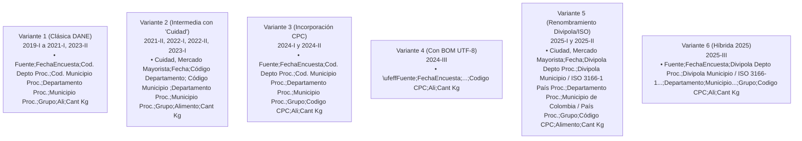
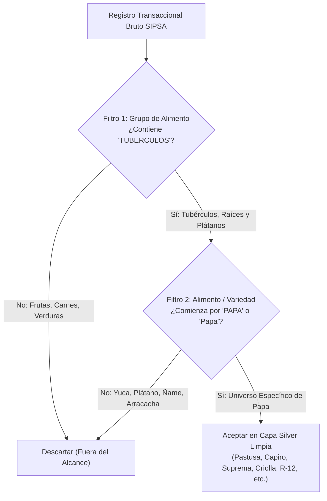

# Batería e Inventario Exhaustivo de Datos Crudos (SIPSA 2019 - 2025)

**Proyecto**: Análisis Histórico del Mercado de la Papa en Colombia (2019 - 2025)  
**Ruta del Repositorio de Fuentes**: `data/RAW/sipsa/`  
**Estándar de Evaluación**: DAMA-BOK (Auditoría de Fuentes, Metadata, Diagnóstico de Ingesta e Inmutabilidad)  
**Fecha de Perfilamiento**: 2026-10-06  

---

## 1. Inventario Físico de Archivos y Metadatos en Disco

El repositorio contiene el histórico completo de abastecimiento mayorista de Colombia recopilado por el DANE. Abarca **16 periodos cronológicos** (10 semestres entre 2019 y 2023, y 6 cuatrimestres entre 2024 y 2025), almacenados en formatos `.csv` (texto delimitado), `.dta` (Stata), `.sav` (SPSS) y `.sas7bdat` (SAS).

### 1.1 Tabla Maestra de Fuentes en `data/RAW/sipsa/`

| Periodo | Directorio Relativo | Archivo CSV Principal | Tamaño CSV | Archivos Binarios Complementarios (DTA / SAV / SAS) |
|---|---|---|---|---|
| **2019 - Semestre I** | `2019_SemI/` | `2019_SemI.csv` | 88.67 MB | `2019_SemI.dta` (144.63 MB), `2019_SemI.sav` (128.86 MB) |
| **2019 - Semestre II** | `2019_SemII/` | `2019_SemII.csv` | 95.05 MB | `2019_SemII.dta` (154.98 MB), `2019_SemII.sav` (138.09 MB) |
| **2020 - Semestre I** | `2020_SemI/` | `2020_SemI.csv` | 87.11 MB | `2020_SemI.dta` (142.36 MB), `2020_SemI.sav` (126.81 MB) |
| **2020 - Semestre II** | `2020_SemII/` | `2020_SemII.csv` | 97.12 MB | `2020_SemII.dta` (158.61 MB), `2020_SemII.sav` (141.42 MB) |
| **2021 - Semestre I** | `2021 ( I Semestre)/` | `2021 ( I Semestre).csv` | 90.08 MB | `2021 ( I Semestre).dta` (166.73 MB), `2021 ( I Semestre).sav` (133.73 MB) |
| **2021 - Semestre II** | `2021 (II.semestre)/2021 (II.semestre)/` *(Anidada)* | `2021(II Semestre).csv` | 99.27 MB | `2021(II Semestre).dta` (163.34 MB), `2021(II Semestre).sav` (146.42 MB) |
| **2022 - Semestre I** | `2022 ( I Semestre )/2022 ( I Semestre )/` *(Anidada)* | `SIPSA_A_Isem2022.csv` | 95.40 MB | `2022(I Semestre).dta` (156.74 MB), `2022(I Semestre).sav` (146.28 MB) |
| **2022 - Semestre II** | `SIPSA_A_IIsem2022/` | `SIPSA_A_IIsem2022.csv` | 94.63 MB | `2022(II Semestre).dta` (160.42 MB), `2022(II Semestre).sav` (147.71 MB) |
| **2023 - Semestre I** | `2023 ( I Semestre )/SIPSA_A_Isem2023/` *(Anidada)* | `SIPSA_A_Isem2023.csv` | 98.36 MB | `2023(I Semestre).dta` (166.38 MB), `2023(I Semestre).sav` (153.50 MB) |
| **2023 - Semestre II** | `2023 ( II Semestre )/2023 ( II Semestre )/` *(Anidada)* | `SIPSA_A_IIsem2023.csv` | 105.90 MB | `2023(II Semestre).dta` (179.01 MB), `2023(II Semestre).sav` (165.23 MB) |
| **2024 - Cuatrimestre I** | `SIPSA_A_Icuatrim2024/` | `SIPSA_A Icuatrim2024.csv` | 79.56 MB | `sipsa_a_icuatrim2024.DTA` (129.13 MB), `sipsa_a_icuatrim2024.sav` (145.96 MB) |
| **2024 - Cuatrimestre II**| `SIPSA_A_IIcuatrim2024/` | `SIPSA_A IIcuatrim2024.csv` | 82.09 MB | `sipsa_a_iicuatrim2024.DTA` (129.15 MB), `sipsa_a_iicuatrim2024.sav` (145.99 MB) |
| **2024 - Cuatrimestre III**| `2024 (III Cuatrimestre) 4/` | `SIPSA_A IIIcuatrim2024.csv` | 84.95 MB | `sipsa_a_iiicuatrim2024.DTA` (161.62 MB), `.sav` (182.69 MB), `.sas7bdat` (162.25 MB) |
| **2025 - Cuatrimestre I** | `2025 (I Cuatrimestre)/` | `2025 (I cuatrimestre).csv` | 81.39 MB | `SIPSA_c1.DTA` (156.00 MB), `SIPSA_c1.sav` (160.14 MB) |
| **2025 - Cuatrimestre II**| `2025 (II cuatrimestre)/` | `2025 (II cuatrimestre).csv` | 85.06 MB | `SIPSA_A.DTA` (371.27 MB), `SIPSA_A.sav` (391.73 MB) |
| **2025 - Cuatrimestre III**| `2025 (III cuatrimestre)/` | `2025 (III cuatrimestre).csv` | 87.31 MB | `iii_cuatrimestre_2025.DTA` (136.16 MB), `.sav` (153.91 MB), `.sas7bdat` (136.69 MB) |

> [!NOTE]
> **Total de datos crudos**: ~1.44 GB en archivos `.csv` comprimibles y ~2.6 GB en binarios analíticos (`.dta` y `.sav`), conformando una base consolidada superior a los **14 millones de registros transaccionales**.

---

## 2. Diagnóstico Empírico de Disparidad de Esquemas (*Schema Drift*)

A partir de la inspección directa del contenido de los archivos en disco, se identificaron **6 variantes distintas de cabeceras** utilizadas por el DANE a lo largo de los 7 años:



---

## 3. Matriz Maestra de Homologación a Esquema Canónico

Para resolver la disparidad de esquemas sin pérdida de información, se establece la siguiente tabla de traducción hacia el **Esquema Canónico Unificado**:

| Campo Canónico | Variante 1 (2019-21, 23-II) | Variante 2 (2021-II a 2023-I) | Variante 3 & 4 (2024) | Variante 5 (2025-I/II) | Variante 6 (2025-III) | Tipo Destino |
|---|---|---|---|---|---|---|
| `mercado_mayorista` | `Fuente` | `Cuidad, Mercado Mayorista` | `Fuente` | `Ciudad, Mercado Mayorista` | `Fuente` | String (Categorical) |
| `fecha_encuesta` | `FechaEncuesta` | `Fecha` | `FechaEncuesta` | `Fecha` | `FechaEncuesta` | Date (`YYYY-MM-DD`) |
| `cod_depto_origen` | `Cod. Depto Proc.` | `Código Departamento` | `Cod. Depto Proc.` | `Divipola Depto Proc.` | `Divipola Depto Proc.` | String (2 dígitos) |
| `cod_mpio_origen` | `Cod. Municipio Proc.` | `Código Municipio` | `Cod. Municipio Proc.`| `Divipola Municipio / ...` | `Divipola Municipio / ...` | String (5 dígitos) |
| `depto_origen` | `Departamento Proc.`| `Departamento Proc.` | `Departamento Proc.` | `Departamento Proc.` | `Departamento` | String |
| `mpio_origen` | `Municipio Proc.` | `Municipio Proc.` | `Municipio Proc.` | `Municipio de Colombia...`| `Municipio de Colombia...`| String |
| `grupo_alimento` | `Grupo` | `Grupo` | `Grupo` | `Grupo` | `Grupo` | String |
| `codigo_cpc` | *[No Existía]* | *[No Existía]* | `Codigo CPC` | `Código CPC` | `Codigo CPC` | String (7 dígitos) |
| `variedad_papa` | `Ali` | `Alimento` | `Ali` | `Alimento` | `Ali` | String (Categorical) |
| `volumen_kg` | `Cant Kg` | `Cant Kg` | `Cant Kg` | `Cant Kg` / ` Cant Kg ` | `Cant Kg` | Float64 (Continuo) |

---

## 4. Diagnóstico de Inconsistencias Físicas y Técnicas Detectadas

### 4.1 Caracteres Parásitos y Comillas Simples en Identificadores
- En los campos de códigos geográficos (`Cod. Depto Proc.`, `Cod. Municipio Proc.`, `Divipola Depto Proc.`) y en `Codigo CPC`, el DANE antepuso de forma generalizada una comilla simple (`'`):
  - Ejemplos observados en los archivos: `'52`, `'52838`, `'15001`, `'0151001`.
  - **Causa técnica**: Estrategia de software de encuestas para forzar a hojas de cálculo a no truncar los ceros a la izquierda.
  - **Tratamiento estandarizado**: `col.str.replace("'", "", regex=False).str.strip()`.

### 4.2 Encoding y Caracteres Especiales del Castellano
- Los archivos fueron exportados originalmente en codificaciones de página de códigos de Europa Occidental (**`Latin-1` / `Windows-1252` / `ISO-8859-1`**).
- Al leerlos con el estándar moderno UTF-8, los caracteres acentuados (`Á`, `É`, `Í`, `Ó`, `Ú`) y la letra `Ñ` generan caracteres corruptos (e.g. `NARI?O`, `T?QUERRES`, `FACATATIV?`, `Br?c...`).
- En el archivo `2024 (III Cuatrimestre) 4/SIPSA_A IIIcuatrim2024.csv`, la cabecera contiene un **Byte Order Mark (BOM)** inicial: `\ufeffFuente`.
- **Tratamiento estandarizado**: Lectura forzada con `encoding='latin-1'` o `encoding_errors='replace'` y remoción de BOM (`utf-8-sig` si aplica).

### 4.3 Formatos de Puntos, Comas y Espacios en Volúmenes (`Cant Kg`)
- Se identificaron tres comportamientos numéricos diferentes en la columna de volumen:
  1. *Numérico entero puro* (2019-2020): `10000`, `3000`, `2500`.
  2. *Puntos de miles en texto* (2021-II y 2024): `"3.420"`, `" 9.000 "`.
  3. *Espacios circundantes*: `" 6.000 "`, `" 1200 "`.
- **Riesgo crítico**: Si se procesa con un convertidor que interprete el punto como decimal anglosajón, un cargamento de 9,000 kg se transformaría erróneamente en 9.0 kg (un error de factor $1,000\times$).
- **Tratamiento estandarizado**:
  ```python
  def limpiar_volumen_kg(serie):
      # 1. Eliminar espacios
      s = serie.astype(str).str.strip()
      # 2. Si contiene punto como separador de miles, removerlo
      s = s.str.replace(".", "", regex=False)
      # 3. Si contiene coma como decimal, sustituir por punto
      s = s.str.replace(",", ".", regex=False)
      # 4. Castear a flotante
      return pd.to_numeric(s, errors="coerce")
  ```

### 4.4 Inconsistencias en Delimitadores Finales (Trailing Semicolons)
- En `2021(II Semestre).csv` la cabecera termina con un punto y coma extra (`;`), generando una columna vacía fantasma al final.
- En `SIPSA_A_Isem2022.csv` la cabecera termina con dos puntos y coma (`;;`), generando dos columnas vacías adicionales.
- **Tratamiento estandarizado**: Descarte automático de columnas sin nombre (`col.startswith('Unnamed')` o totalmente nulas).

---

## 5. Estrategia de Filtrado y Aislamiento del Universo Papa

El SIPSA abarca la totalidad de alimentos de la economía nacional (frutas, verduras, carnes, granos, procesados). Para aislar con 100% de precisión el mercado papero sin falsos positivos ni falsos negativos:



---

## 6. Inventario de Variedades Identificadas en los Datos Crudos

Al escanear el subgrupo de papa en los microdatos históricos se identificaron las siguientes variedades comerciales activas:

1. **Papa Suprema**: Presente de forma continua en todos los periodos con gran volumen en plazas del Eje Cafetero, Valle y Bogotá.
2. **Papa Capira / Diacol Capiro**: Registrada bajo diversas grafías (`Papa capira`, `Papa capiro`, `Papa diacol capiro`), liderando los envíos hacia la agroindustria y Antioquia.
3. **Papa Pastusa / Parda Pastusa**: Variedad reina tradicional de consumo en fresco en Cundinamarca, Boyacá y Nariño.
4. **Papa Criolla (Limpia y Sucia)**: Registrada bajo denominaciones comerciales diferenciadas por calidad de lavado.
5. **Papa R-12 / Negra**: Frecuente en los despachos originados en Ipiales, Túquerres y Pasto.
6. **Papa Superior / Única / Betina / Tuquerreña**: Variedades secundarias de alto valor para análisis de sustitución.
