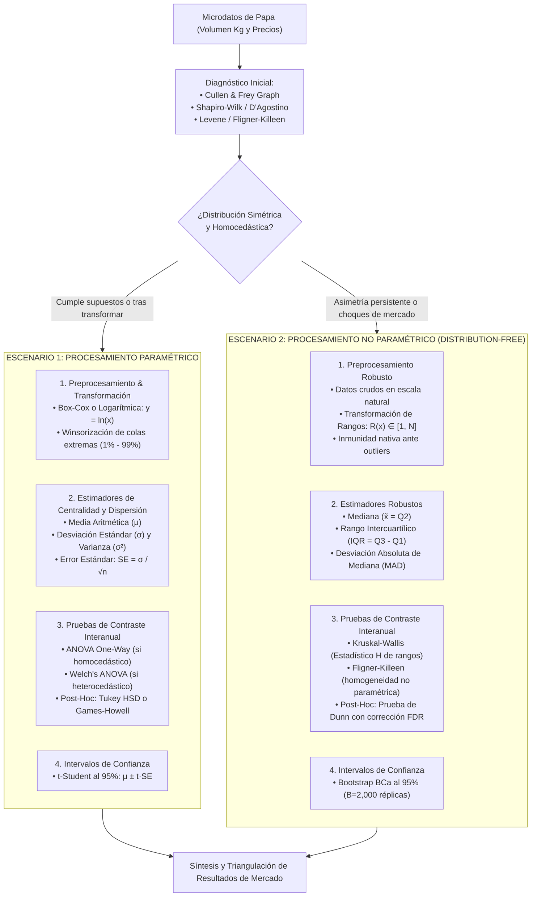
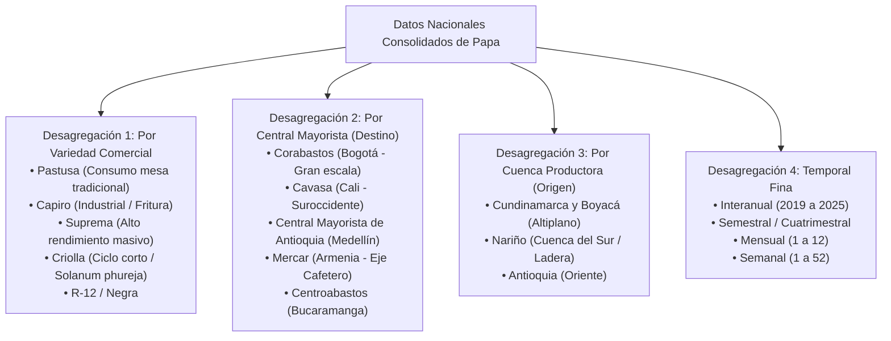

# Batería de Pruebas Estadísticas e Inferenciales

**Proyecto**: Análisis Histórico del Mercado de la Papa en Colombia (2019 - 2025)  
**Dominio**: Estadística Matemática, Inferencia y Análisis Comparativo Interanual  
**Enfoque**: Arquitectura Dual de Procesamiento (Paramétrico vs. No Paramétrico) con Máximo Rigor  

---

## 1. Arquitectura Dual de Procesamiento: Paramétrico vs. No Paramétrico

El análisis de microdatos agropecuarios enfrenta una disyuntiva metodológica crítica: la mayoría de los modelos clásicos asumen normalidad y varianzas homogéneas, mientras que las series reales de oferta y precios de la papa presentan **alta asimetría positiva, colas pesadas y choques exógenos**. 

Por ello, se formalizan **dos escenarios de procesamiento paralelos y complementarios**, cada uno con su pipeline de transformación, estimadores, pruebas e intervalos de confianza:

---

## 2. Matriz Comparativa Detallada entre Ambos Escenarios

| Criterio Metodológico | Escenario 1: Paramétrico | Escenario 2: No Paramétrico |
|---|---|---|
| **Supuesto Fundamental** | Normalidad $N(\mu, \sigma^2)$ y varianzas iguales | Sin supuestos distribucionales (*Distribution-Free*) |
| **Transformación de Entrada** | Requiere estabilización: Log $\ln(x)$, Box-Cox $y^{(\lambda)}$ o Yeo-Johnson | Conserva escala natural; opera sobre rangos $R(x)$ |
| **Medida de Tendencia Central** | **Media aritmética ($\mu$)** | **Mediana ($\tilde{x}$ / Percentil 50)** |
| **Medida de Dispersión** | **Desviación estándar ($\sigma$) y Varianza ($\sigma^2$)** | **Rango Intercuartílico ($\text{IQR}$) y $\text{MAD}$** |
| **Tratamiento de Outliers** | **Sensible**: Requiere Winsorización para no distorsionar $\mu$ | **Robusto**: Resistente a choques reales (paros, COVID) |
| **Prueba de Homogeneidad** | Prueba de Bartlett o Levene | Prueba de Fligner-Killeen |
| **Contraste de Periodos Anuales**| **ANOVA de un factor ($F$-test)** o Welch ANOVA | **Prueba de Kruskal-Wallis ($H$-test)** |
| **Análisis Post-Hoc** | Tukey HSD o Games-Howell | Prueba de Dunn con corrección Benjamini-Hochberg (FDR) |
| **Intervalo de Confianza (95%)** | $t$-Student: $\bar{x} \pm t_{(0.025, n-1)} \frac{s}{\sqrt{n}}$ | **Bootstrap BCa** ($B=2,000$ réplicas empíricas) |
| **Poder Estadístico** | Máximo si se cumplen supuestos | Elevado ($>95\%$ de eficiencia asintótica relativa) |
| **Mejor Caso de Uso en Papa** | Series agregadas mensuales ya estabilizadas | Microdatos diarios/semanales y análisis de choques |

---

## 3. Diagnóstico Inicial: Gráfico de Cullen and Frey

Antes de asignar una variable a cualquiera de los dos escenarios, se construye el gráfico de **Cullen and Frey** proyectando el **cuadrado del coeficiente de asimetría ($\text{Skewness}^2 = \beta_1$)** frente a la **curtosis ($\beta_2$)**:

- **Fórmulas de Momentos**:
  $$\text{Asimetría: } \sqrt{b_1} = \frac{\frac{1}{n}\sum_{i=1}^{n}(x_i - \bar{x})^3}{\left[\frac{1}{n}\sum_{i=1}^{n}(x_i - \bar{x})^2\right]^{3/2}}, \quad \text{Curtosis: } b_2 = \frac{\frac{1}{n}\sum_{i=1}^{n}(x_i - \bar{x})^4}{\left[\frac{1}{n}\sum_{i=1}^{n}(x_i - \bar{x})^2\right]^2}$$
- **Interpretación del Diagnóstico**:
  - Si el punto empírico cae cercano a la coordenada $(0, 3)$, los datos se aproximan a la **Normal** $\implies$ **Apto para Escenario 1**.
  - Si el punto se sitúa en la zona de distribuciones **Lognormal, Gamma o Weibull** con $\text{Skewness} > 2.0$ $\implies$ Requiere transformación Box-Cox en el Escenario 1, o preferiblemente procesamiento directo en el **Escenario 2**.
  - Se acompaña de remuestreo Bootstrap ($B = 1,000$) para observar la dispersión del estimador.

---

## 4. Detalle Operativo del Escenario 1: Paramétrico

### 4.1 Transformaciones Estabilizadoras de Varianza
Para cumplir los supuestos de la prueba ANOVA:
- **Transformación Logarítmica Natural**:
  $$y_i = \ln(x_i), \quad \text{para } x_i > 0$$
- **Transformación Box-Cox**:
  $$y_i^{(\lambda)} = \begin{cases} \frac{x_i^\lambda - 1}{\lambda}, & \text{si } \lambda \neq 0 \\ \ln(x_i), & \text{si } \lambda = 0 \end{cases}$$
  *El parámetro $\lambda$ se optimiza mediante estimación de máxima verosimilitud.*

### 4.2 Pruebas de Homocedasticidad Paramétrica
- **Prueba de Levene** (centrada en la media o mediana):
  $$W = \frac{(N - k)}{(k - 1)} \frac{\sum_{i=1}^{k} n_i (\bar{z}_{i\cdot} - \bar{z}_{\cdot\cdot})^2}{\sum_{i=1}^{k} \sum_{j=1}^{n_i} (z_{ij} - \bar{z}_{i\cdot})^2}$$
  - Si $p > 0.05$: Se acepta igualdad de varianzas $\implies$ ANOVA estándar.
  - Si $p \le 0.05$: Se rechaza igualdad de varianzas $\implies$ Welch's ANOVA.

### 4.3 ANOVA y Post-Hoc
- **ANOVA de un factor**: Descompone la variabilidad entre años ($\text{MS}_{\text{Between}}$) frente a la variabilidad interna de los años ($\text{MS}_{\text{Within}}$). Estadístico $F = \frac{\text{MS}_B}{\text{MS}_W}$.
- **Post-Hoc Tukey HSD**: Calcula la diferencia honestamente significativa entre pares de años (2019 vs 2020, 2020 vs 2021, etc.).
- **Post-Hoc Games-Howell**: Utilizado si no se cumple homocedasticidad tras Welch's ANOVA.

### 4.4 Intervalos de Confianza Paramétricos (95%)
$$\text{IC}_{95\%}(\mu) = \bar{x} \pm t_{(0.025, \, n-1)} \times \frac{s}{\sqrt{n}}$$

---

## 5. Detalle Operativo del Escenario 2: No Paramétrico

### 5.1 Estimadores Robustos
En lugar de depender de la media (altamente distorsionada por cargas de 30 toneladas o colapsos de paro), se reportan:
- **Mediana ($\tilde{x}$)**: Valor central que divide la distribución al 50%.
- **Rango Intercuartílico ($\text{IQR} = Q_3 - Q_1$)**: Dispersión del 50% central de los datos.
- **MAD (Median Absolute Deviation)**:
  $$\text{MAD} = \text{mediana}(|x_i - \tilde{x}|)$$
  *Estimador de escala inmune a valores extremos.*

### 5.2 Prueba de Fligner-Killeen
Prueba no paramétrica que evalúa si la dispersión por rangos varía entre periodos anuales, sin requerir normalidad.

### 5.3 Prueba de Kruskal-Wallis ($H$)
- Asigna rangos $1$ a $N$ a todas las transacciones de 2019 a 2025:
  $$H = \frac{12}{N(N + 1)} \sum_{i=1}^{k} \frac{R_i^2}{n_i} - 3(N + 1)$$
- Se aplica el factor de corrección por empates: $H_{\text{corregido}} \sim \chi^2_{(k-1)}$.
- **Post-Hoc de Dunn**:
  $$z = \frac{\bar{R}_i - \bar{R}_j}{\sqrt{\left[\frac{N(N + 1)}{12} - \frac{\sum (t^3 - t)}{12(N - 1)}\right] \left(\frac{1}{n_i} + \frac{1}{n_j}\right)}}$$
  *Se ajustan los $p$-valores mediante el procedimiento de Benjamini-Hochberg (FDR) para evitar falsos positivos.*

### 5.4 Intervalos de Confianza Bootstrap BCa (95%)
Para la mediana y los percentiles de mercado, se generan $B = 2,000$ muestras bootstrap:
- Se calcula la aceleración $a$ mediante jackknife para capturar asimetría.
- Se calcula la corrección de sesgo $z_0$:
  $$z_0 = \Phi^{-1}\left(\frac{\#\{\hat{\theta}^* < \hat{\theta}\}}{B}\right)$$
- Los percentiles ajustados $[\alpha_1, \alpha_2]$ producen un intervalo empírico exacto:
  $$\text{IC}_{95\%}^{\text{BCa}} = \left[\hat{\theta}_{(\alpha_1)}^{*}, \, \hat{\theta}_{(\alpha_2)}^{*}\right]$$

---

## 6. Guía de Selección para los Investigadores del Proyecto

1. **Para Reportes Ejecutivos Macro**: Presentar la **Media $\pm$ IC Paramétrico** (tras transformación) junto a la **Mediana con IC Bootstrap BCa**, permitiendo ver la brecha entre el promedio global y la realidad cotidiana del mercado.
2. **Para Análisis de Choques y Crisis (COVID 2020, Paros 2021)**: Utilizar estrictamente el **Escenario 2 (No Paramétrico)** para evitar que los valores atípicos reales sean mutilados o distorsionen los resultados.
3. **Para Series Agregadas Mensuales Homogéneas**: Utilizar el **Escenario 1 (Paramétrico con Welch y Games-Howell)** para maximizar la potencia comparativa entre los 7 años.

---

## 7. Protocolo de Pruebas Estadísticas Estratificadas por Niveles de Desagregación

El análisis de mercado nunca debe limitarse a contrastes globales agregados, ya que se incurriría en la **Paradoja de Simpson** (donde una tendencia nacional agregada oculta o contradice el comportamiento real de las variedades o plazas individuales). Se establece el siguiente marco de desagregación inferencial:

### 7.1 Reglas de Contraste Estratificado
1. **Contraste Interanual Condicionado por Variedad**:
   - Se ejecuta una prueba de **Kruskal-Wallis / ANOVA independiente para cada variedad**:
     $$H_0^{(v)}: \text{Distribución de Volumen/Precio de la Variedad } v \text{ es idéntica entre 2019 y 2025}$$
   - Esto permite detectar si el choque de precios afectó más a la Papa Pastusa que a la Papa Criolla o Capiro.
2. **Contraste de Plazas Mayoristas por Época de Choque**:
   - Durante eventos extraordinarios (ej. Paro 2021), se contrasta la diferencia de caída entre plazas mediante pruebas de Mann-Whitney / Kruskal-Wallis estratificadas:
     - Cavasa (planta cerrada por bloqueos) vs. Corabastos (abastecimiento parcial del altiplano).
3. **Control de Multiplicidad de Pruebas (FDR)**:
   - Al ejecutar contrastes para $V = 5$ variedades principales en $P = 5$ grandes plazas a lo largo de 7 años, se generan decenas de hipótesis simultáneas.
   - **Regla Obligatoria**: Aplicar corrección de **Benjamini-Hochberg (FDR)** a la familia de $p$-valores para garantizar que la tasa de falsos descubrimientos no supere $\alpha = 0.05$.
4. **Intervalos de Confianza Desagregados**:
   - Cada variedad en cada plaza cuenta con su propio par de intervalos:
     $$\text{IC}_{95\%}(\text{Precio Pastusa en Corabastos}), \quad \text{IC}_{95\%}^{\text{BCa}}(\text{Precio Capiro en Cavasa})$$
