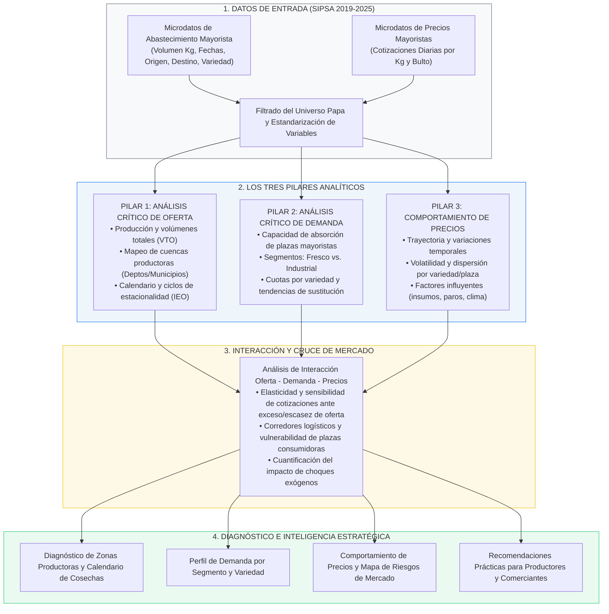
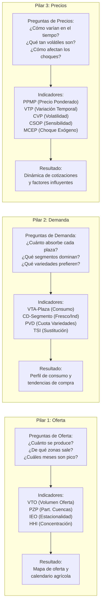
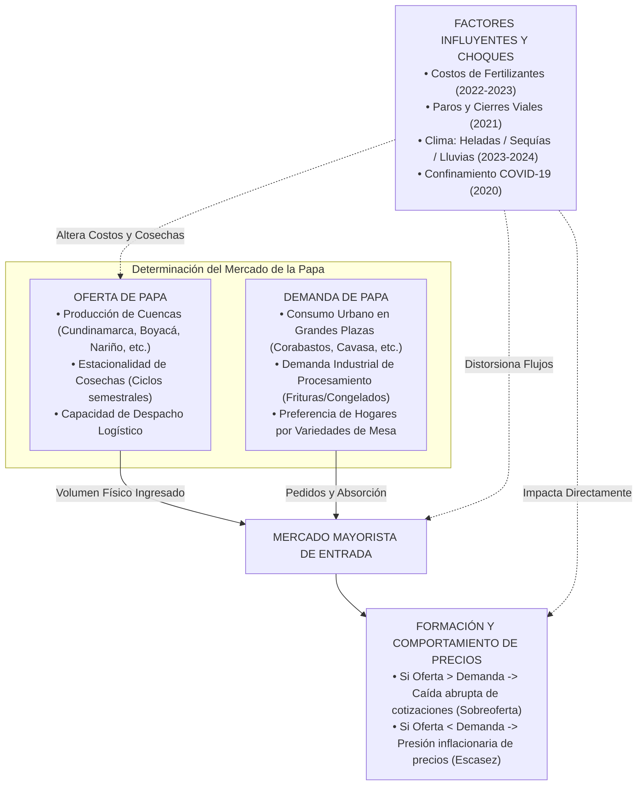
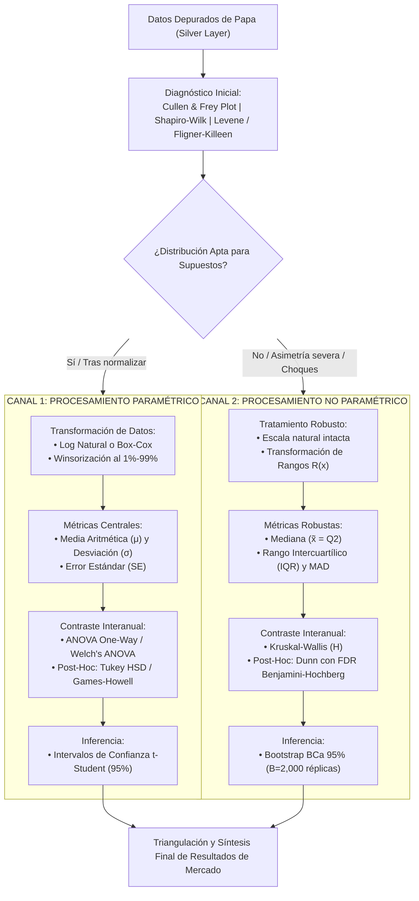

# Diagrama Metodológico: El "Cómo" del Análisis de Mercado

**Proyecto**: Análisis Histórico del Mercado de la Papa en Colombia (2019 - 2025)  
**Fuente**: Microdatos SIPSA - DANE (Abastecimiento y Precios)  
**Enfoque**: Metodología Tripartita de Análisis de Mercado: **Oferta**, **Demanda** y **Precios**.

---

## 1. Diagrama de Flujo Metodológico Integral

Este diagrama muestra cómo se procesa la información desde los registros brutos del SIPSA hasta la obtención de diagnósticos y conclusiones de negocio, estructurado en los tres pilares del estudio:

---

## 2. Diagrama de Relación: Preguntas $\rightarrow$ Indicadores $\rightarrow$ Resultados

Muestra la articulación directa entre las preguntas de investigación formuladas, las métricas calculadas y los resultados obtenidos para cada uno de los tres pilares:

---

## 3. Diagrama de Formación del Mercado: Interacción Oferta vs. Demanda $\rightarrow$ Precios

---

## 3.1 Diagrama del Doble Canal de Procesamiento: Paramétrico vs. No Paramétrico

---

## 4. Descripción del Procedimiento Metodológico Paso a Paso

### Paso 1: Depuración y Homologación de Microdatos
- Filtrar la base histórica SIPSA para retener exclusivamente las líneas asociadas al tubérculo de papa.
- Estandarizar nombres comerciales de variedades (Pastusa, Capiro, Suprema, Criolla, R-12, etc.), plazas mayoristas y municipios de origen con código DIVIPOLA.

### Paso 2: Ejecución del Análisis Crítico de Oferta
1. **Volumen**: Agregar el volumen total por año, cuatrimestre/semestre, mes y semana para medir la trayectoria de la producción.
2. **Geografía**: Identificar la matriz de departamentos y municipios emisores para evaluar la concentración de zonas productoras (Índice HHI).
3. **Índice de Estacionalidad**: Calcular el Índice de Estacionalidad de la Oferta (IEO, base 100) para graficar los meses recurrentes de sobreabastecimiento ($>115$) y escasez ($<85$).
4. **Periodos de Producción y Granularidad**: Reconocer los ciclos vegetativos por variedad (papas de año de 5–6 meses vs. papa criolla de 3.5–4 meses), los desfases de cosechas regionales (Altiplano vs. Nariño vs. Antioquia) y analizar los datos en 5 escalas de granularidad temporal (diaria, semanal, mensual, periódica DANE y anual).

### Paso 3: Ejecución del Análisis Crítico de Demanda
1. **Consumo por Plaza**: Cuantificar el volumen absorbido por Corabastos, Cavasa, Central Mayorista de Antioquia, Mercar, etc.
2. **Segmentación**: Separar el volumen demandado por variedades de mesa vs. variedades de aptitud industrial vs. papa criolla.
3. **Tendencias**: Evaluar el crecimiento o caída de la cuota de mercado de cada variedad a lo largo de los 7 años analizados.
4. **Demanda Aparente y Consumo Per-Cápita**: Calcular la demanda aparente agregada y el consumo per cápita anual (en Toneladas y en Kilogramos por habitante) utilizando las proyecciones poblacionales oficiales del DANE (2019–2025).

### Paso 4: Examen del Comportamiento de Precios
1. **Trayectoria Temporal**: Construir las series de precios promedio mensuales ponderados por volumen.
2. **Volatilidad**: Calcular el coeficiente de variación de precios por variedad y por plaza para medir el riesgo de mercado.
3. **Factores Influyentes**: Cruzar los periodos de coyuntura (COVID 2020, Paros 2021, alza de fertilizantes 2022-23, eventos climáticos) contra la cotización media para aislar la magnitud del impacto de cada factor.

### Paso 5: Integración y Generación de Conclusiones
- Cruzar curvas de oferta vs. curvas de precios para obtener la elasticidad real del mercado.
- Generar cuadros de resumen, tablas cruzadas y visualizaciones de tendencias.
- Redactar recomendaciones estratégicas dirigidas a productores, distribuidores y planificadores del sector.
