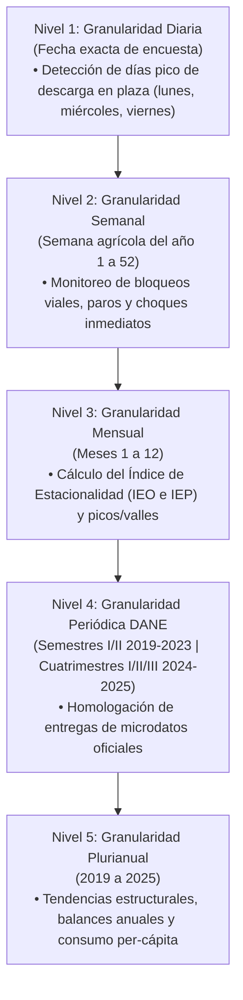

# Ficha Metodológica de Indicadores y Caracterización del Mercado de la Papa

**Proyecto**: Análisis Histórico del Mercado de la Papa en Colombia (2019 - 2025)  
**Fuente**: SIPSA - DANE / Proyecciones Demográficas DANE  
**Alcance**: Metodología de Medición de Demanda, Índices de Estacionalidad y Periodos de Producción con Enfoque de Granularidad  

---

## 1. Módulo de Demanda y Consumo Nacional

### 1.1 Esquema Conceptual
Permite cuantificar la absorción real del mercado y el nivel de ingesta promedio en los hogares colombianos mediante el cruce entre los volúmenes del sistema de abasto mayorista y la población proyectada.

### 1.2 Fichas Técnicas de Indicadores de Demanda

#### FICHA 1: Demanda Aparente (DA)
- **Definición**: Masa total neta de papa disponible para el consumo doméstico en Colombia en un periodo determinado.
- **Fórmula de Cálculo**:
  $$\text{DA}_{t} = \text{Abastecimiento Mayorista Registrado}_{t} + \text{Importaciones}_{t} - \text{Exportaciones}_{t}$$
  *(En el marco del SIPSA: agregado de ingresos a centrales mayoristas).*
- **Unidad de Medida**: Toneladas métricas (Ton) y Kilogramos (Kg).
- **Periodicidad**: Anual y Semestral / Cuatrimestral.
- **Interpretación**: Mide la absorción física agregada del mercado.

#### FICHA 2: Población Colombia (POB_COL)
- **Definición**: Número total de habitantes residentes proyectados por el DANE (Censo CNPV 2018).
- **Serie de Referencia Anual**:
  - 2019: ~49,358,000 hab.
  - 2020: ~50,372,000 hab.
  - 2021: ~51,049,000 hab.
  - 2022: ~51,609,000 hab.
  - 2023: ~52,215,000 hab.
  - 2024: ~52,695,000 hab.
  - 2025: ~53,100,000 hab.
- **Unidad de Medida**: Habitantes.
- **Periodicidad**: Anual (a mitad de periodo).

#### FICHA 3: Consumo per-cápita (Ton) (CPC_TON)
- **Definición**: Toneladas de papa consumidas en promedio por habitante al año.
- **Fórmula**:
  $$\text{CPC\_TON}_{t} = \frac{\text{Demanda Aparente (Ton)}_{t}}{\text{Población Colombia}_{t}}$$
- **Unidad**: Ton/hab/año.
- **Periodicidad**: Anual.

#### FICHA 4: Consumo per-cápita (Kg) (CPC_KG)
- **Definición**: Kilogramos de papa consumidos en promedio por persona al año en Colombia.
- **Fórmula**:
  $$\text{CPC\_KG}_{t} = \text{CPC\_TON}_{t} \times 1,000 = \frac{\text{Demanda Aparente (Kg)}_{t}}{\text{Población Colombia}_{t}}$$
- **Unidad**: Kg/hab/año.
- **Rango de Referencia**: 35 a 60 kg/hab/año según zona geográfica y año de cosecha.

#### FICHA 5: Producción per-cápita (Ton) (PPC_TON)
- **Definición**: Toneladas de papa generadas u ofertadas por habitante en un territorio y periodo determinado. Mide la capacidad y vocación agroproductiva bruta del territorio.
- **Fórmula de Cálculo**:
  - **A Nivel Nacional**:
    $$\text{PPC\_TON}_{t} = \frac{\text{Volumen Total Producido / Ofertado (Ton)}_{t}}{\text{Población Total Colombia}_{t}}$$
  - **A Nivel Departamental (Desagregado)**:
    $$\text{PPC\_TON}_{d, t} = \frac{\text{Volumen Ofertado desde el Departamento } d \text{ (Ton)}_{t}}{\text{Población Residente en el Departamento } d_{t}}$$
- **Unidad de Medida**: Toneladas / habitante / año (Ton/hab/año).
- **Periodicidad**: Anual.
- **Interpretación**: A escala departamental revela la hiper-especialización papera de departamentos como Boyacá, Cundinamarca o Nariño, cuya producción per cápita supera con creces su demanda local.

#### FICHA 6: Producción per-cápita (Kg) (PPC_KG)
- **Definición**: Masa física de papa en kilogramos producida por habitante al año.
- **Fórmula de Cálculo**:
  $$\text{PPC\_KG}_{t} = \text{PPC\_TON}_{t} \times 1,000 = \frac{\text{Volumen Ofertado (Kg)}_{t}}{\text{Población}_{t}}$$
- **Unidad de Medida**: Kilogramos / habitante / año (Kg/hab/año).
- **Periodicidad**: Anual.
- **Interpretación**: Permite la comparación directa en la misma escala métrica frente al Consumo per-cápita (`CPC_KG`).

#### FICHA 7: Balance Per-Cápita y Ratio de Autosuficiencia (BPC / RAPC)
- **Definición**: Relación neta entre la capacidad de producción de un territorio y su volumen de consumo estimado por habitante.
- **Fórmulas de Cálculo**:
  - **Balance Per-Cápita (BPC)**:
    $$\text{BPC} = \text{PPC\_KG} - \text{CPC\_KG}$$
    - $\text{BPC} > 0$: **Territorio Superavitario / Exportador Neto** (abastece a otras regiones del país).
    - $\text{BPC} < 0$: **Territorio Deficitario / Receptor Neto** (depende de cuencas externas).
  - **Ratio de Autosuficiencia Per-Cápita (RAPC)**:
    $$\text{RAPC} = \left(\frac{\text{PPC\_KG}}{\text{CPC\_KG}}\right) \times 100\%$$
- **Unidad de Medida**: Kilogramos/hab/año para el balance, y Porcentaje (%) para el ratio.
- **Periodicidad**: Anual.

---

## 2. Módulo de Estacionalidad del Mercado

### 2.1 Metodología de Cálculo del Índice de Estacionalidad (IE)

El índice de estacionalidad aísla el comportamiento intra-anual recurrente del mercado (picos de recolección y temporadas de escasez) respecto al promedio general de la serie temporal (2019–2025), utilizando el método de **Razón al Promedio Mensual Histórico** (Base 100):

#### FICHA 5: Índice de Estacionalidad de la Oferta (IEO)
- **Definición**: Porcentaje relativo en que el volumen ofertado en un mes específico se sitúa por encima o por debajo del mes promedio anual típico.
- **Fórmula de Cálculo**:
  $$\text{IEO}_{m} = \left(\frac{\frac{1}{K}\sum_{k=2019}^{2025} \text{Volumen}_{m, k}}{\frac{1}{12}\sum_{j=1}^{12} \left(\frac{1}{K}\sum_{k=2019}^{2025} \text{Volumen}_{j, k}\right)}\right) \times 100$$
  *Donde $m \in \{1, 2, \dots, 12\}$ representa el mes calendario y $k$ el año.*
- **Unidad**: Índice porcentual (Base 100 = promedio de año).
- **Criterio de Interpretación**:
  - $\text{IEO}_{m} > 115$: **Pico de Cosecha / Alta Oferta** (riesgo de caída de precios).
  - $85 \le \text{IEO}_{m} \le 115$: **Temporada de Oferta Normal / Equilibrio**.
  - $\text{IEO}_{m} < 85$: **Valle de Producción / Escasez** (presión alcista de precios).

#### FICHA 6: Índice de Estacionalidad de Precios (IEP)
- **Definición**: Mide la fluctuación cíclica de las cotizaciones mayoristas promedio en cada mes calendario a lo largo del año.
- **Fórmula de Cálculo**:
  $$\text{IEP}_{m} = \left(\frac{\overline{\text{Precio Mayorista Ponderado}}_{m}}{\overline{\text{Precio Promedio General de la Serie}}}\right) \times 100$$
- **Interpretación**: Permite contrastar la simetría inversa: típicamente los meses de $\text{IEO}$ máximo coinciden con los de $\text{IEP}$ mínimo.

---

## 3. Reconocimiento de los Periodos de Producción y su Granularidad

La producción de papa en Colombia no es homogénea ni estática. Su análisis requiere distinguir entre **granularidad agronómica (biológica)**, **granularidad geográfica (regional)** y **granularidad temporal de los datos**.

### 3.1 Granularidad Agronómica: Ciclos Vegetativos por Variedad

El tiempo requerido desde la siembra hasta la cosecha determina la cadencia de oferta en plaza:

| Tipo de Papa | Variedades Representativas | Ciclo Vegetativo | Frecuencia de Cosecha | Característica del Periodo |
|---|---|---|---|---|
| **Papa de Año (Ciclo Largo)** | *Pastusa, Diacol Capiro, Suprema, R-12/Negra, Sabanera* | **5 a 6 meses** (150 – 180 días) | 2 ciclos principales al año (semestrales) | Concentra los grandes picos de oferta nacional; alta inercia productiva. |
| **Papa Criolla (Ciclo Corto)** | *Papa Criolla limpia, Criolla común / sucia* | **3.5 a 4 meses** (105 – 120 días) | 3 ciclos al año (cuatrimestrales) | Mayor rotación de cosechas; amortigua caídas de oferta entre ciclos largos. |

---

### 3.2 Granularidad Geográfica: Desfase de Calendarios por Cuenca Productora

En Colombia el régimen bimodal de lluvias y las altitudes generan calendarios de cosecha desfasados entre regiones, lo que amortigua parcialmente la escasez nacional:

```
┌────────────────────────────────────────────────────────────────────────┐
│               CALENDARIO DE PERIODOS DE PRODUCCIÓN                     │
├────────────────────┬───────────────────────────────────────────────────┤
│ ZONA PRODUCTORA    │ PERIODOS DE SIEMBRA Y COSECHA                     │
├────────────────────┼───────────────────────────────────────────────────┤
│ Cundinamarca y     │ • Ciclo A: Siembra Feb-Mar → Cosecha Pico Jul-Ago │
│ Boyacá (Altiplano) │ • Ciclo B: Siembra Ago-Sep → Cosecha Pico Dic-Ene │
├────────────────────┼───────────────────────────────────────────────────┤
│ Nariño             │ • Cosechas escalonadas por microclimas de ladera: │
│ (Cuenca del Sur)   │   Picos en Mayo-Junio y Octubre-Noviembre         │
├────────────────────┼───────────────────────────────────────────────────┤
│ Antioquia          │ • Cosechas continuas hacia el mercado industrial  │
│ (Oriente)          │   con regularidad bimestral (Variedad Capiro)     │
└────────────────────┴───────────────────────────────────────────────────┘
```

---

### 3.3 Niveles de Granularidad Temporal en los Microdatos SIPSA

Para capturar la dinámica real, los datos se analizan en 5 escalas temporales:



#### Aplicación de cada nivel de granularidad:
1. **Diaria (`FechaEncuesta`)**: Permite identificar la operativa de los días de mayor flujo comercial en plazas mayoristas (e.g., madrugadas de mercado en Corabastos o Cavasa).
2. **Semanal**: Ideal para capturar el impacto súbito de choques logísticos (ej. las semanas 18 a 22 de 2021 durante el paro nacional).
3. **Mensual**: Unidad estándar para la descomposición estacional de series de tiempo y comparación de precios.
4. **Periódica DANE**: Respeta la estructura de recolección semestral histórica y cuatrimestral reciente del SIPSA.
5. **Anual**: Base para el cálculo macroeconómico de Demanda Aparente y Consumo Per Cápita (`Kg/hab/año`).

---

## 4. Matriz Resumen de Fichas Metodológicas

| Componente | Código | Nombre del Indicador / Método | Unidad | Granularidad Óptima |
|---|---|---|---|---|
| **Demanda** | `DA` | Demanda Aparente Nacional | Ton / Kg | Anual / Semestral |
| **Demanda** | `POB_COL` | Población de Colombia (DANE) | Habitantes | Anual |
| **Demanda** | `CPC_TON` | Consumo per-cápita en Toneladas | Ton/hab/año | Anual |
| **Demanda** | `CPC_KG` | Consumo per-cápita en Kilogramos | Kg/hab/año | Anual |
| **Estacionalidad** | `IEO` | Índice de Estacionalidad de Oferta | Base 100 | Mensual |
| **Estacionalidad** | `IEP` | Índice de Estacionalidad de Precios | Base 100 | Mensual |
| **Producción** | `CP_VARIEDAD` | Ciclo Productivo por Variedad | Días / Meses | Agronómica (120 a 180 días) |
| **Producción** | `CAL_REGIONAL`| Calendario Regional de Cosecha | Meses pico | Cuenca Productora |
| **Datos SIPSA** | `GRAN_TEMP` | Granularidad Temporal Multinivel | 5 Niveles | Diaria $\rightarrow$ Anual |
