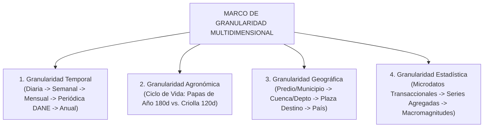
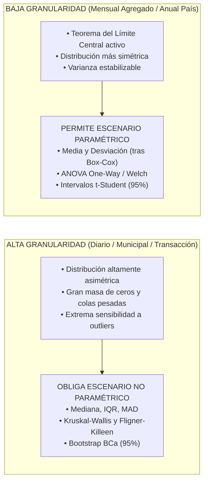

# Manual de Granularidad Analítica y Resolución de Datos

**Proyecto**: Análisis Histórico del Mercado de la Papa en Colombia (2019 - 2025)  
**Fuente**: SIPSA - DANE  
**Marco Teórico**: DAMA-BOK (Modelado Dimensional, Agregabilidad y Calidad) y Fenología Agrícola  

---

## 1. Fundamento Conceptual de la Granularidad

La **granularidad** define el nivel más fino de detalle y resolución con el que se registran, procesan y analizan los datos en el sistema. En el estudio del mercado de la papa, seleccionar la granularidad correcta es crítico para evitar dos fallas analíticas comunes:

1. **Sobre-agregación (Pérdida de Información / Falacia Ecológica)**: Analizar únicamente cifras anuales o nacionales oculta colapsos de oferta en semanas críticas de paro, descalabros de precios en plazas específicas o desfases en los ciclos de cosecha entre departamentos.
2. **Sub-agregación (Ruido e Inestabilidad Estadística)**: Analizar únicamente transacciones individuales o registros diarios sin estructuración temporal genera excesiva dispersión estocástica e impide observar las tendencias estructurales de mediano y largo plazo.

Por consiguiente, el proyecto implementa un **marco de granularidad multidimensional** articulado en 4 dimensiones: **Temporal**, **Agronómica (Biológica)**, **Geográfica** y **Metodológica-Estadística**.



---

## 2. Dimensión 1: Granularidad Temporal (Escalas de Tiempo)

El SIPSA ofrece datos con marca temporal diaria, lo que permite navegar a través de 5 niveles jerárquicos de resolución temporal:

```
┌────────────────────────────────────────────────────────────────────────┐
│                   JERARQUÍA DE GRANULARIDAD TEMPORAL                   │
├───────────────┬───────────────────────────┬────────────────────────────┤
│ NIVEL         │ UNIDAD DE MEDIDA          │ CASO DE USO Y APLICACIÓN   │
├───────────────┼───────────────────────────┼────────────────────────────┤
│ 1. Atómico    │ Día (`FechaEncuesta`)     │ Dinámica operativa en      │
│               │ Días de semana (Lun-Vie)  │ plaza, descargas matutinas │
├───────────────┼───────────────────────────┼────────────────────────────┤
│ 2. Semanal    │ Semanas del Año (1 a 52)  │ Choques súbitos: Paro 2021,│
│               │                           │ cuarentena COVID, heladas  │
├───────────────┼───────────────────────────┼────────────────────────────┤
│ 3. Mensual    │ Meses (1 a 12)            │ Índice de Estacionalidad   │
│               │                           │ (IEO/IEP), series de tiempo│
├───────────────┼───────────────────────────┼────────────────────────────┤
│ 4. Periódico  │ Semestres (2019–2023)     │ Homologación con cortes    │
│    DANE       │ Cuatrimestres (2024–2025) │ oficiales de microdatos    │
├───────────────┼───────────────────────────┼────────────────────────────┤
│ 5. Macro      │ Años (2019 a 2025)        │ Demanda Aparente, Consumo  │
│               │ Septenio completo         │ per-cápita y tendencias    │
└───────────────┴───────────────────────────┴────────────────────────────┘
```

### 2.1 Nivel 1: Granularidad Diaria e Intrasemanal
- **Propósito**: Capturar el pulso logístico de las centrales de abasto.
- **Fenómeno Observable**: En plazas como Corabastos (Bogotá) o Cavasa (Cali), los volúmenes de descarga no se distribuyen equitativamente entre los 7 días. Los lunes, miércoles y viernes concentran los mayores picos de ingreso de camiones procedentes del campo, mientras que los fines de semana abastecen primordialmente a tenderos y hogares minoristas.
- **Tratamiento**: Agrupación por variable `dia_semana` (0 = Lunes, ..., 6 = Domingo) para normalizar días hábiles de reporte.

### 2.2 Nivel 2: Granularidad Semanal (Semana Agrícola 1 a 52)
- **Propósito**: Evaluación forense de choques y contingencias exógenas.
- **Justificación**: Un paro vial o un bloqueo de carreteras raramente dura un mes calendario exacto; suele impactar ventanas de 2 a 4 semanas. 
  - *Ejemplo histórico*: El Paro Nacional de 2021 golpeó con mayor dureza las **semanas 18 a 22 (mayo de 2021)**. Medir este evento a granularidad mensual disuelve el efecto real del bloqueo, mientras que la granularidad semanal permite ver el colapso a cero del abastecimiento en Cavasa y su posterior rebote inflacionario.

### 2.3 Nivel 3: Granularidad Mensual (Estándar de Estacionalidad)
- **Propósito**: Descomposición formal de series de tiempo y cálculo del Índice de Estacionalidad ($\text{IEO}$ e $\text{IEP}$, base 100).
- **Justificación**: A nivel mensual se cancela el ruido de la variabilidad diaria y se conserva con nitidez la señal del ciclo de cosechas agrícolas.

### 2.4 Nivel 4: Granularidad Periódica Oficial DANE (Semestral vs. Cuatrimestral)
- **Cambio Estructural DANE**:
  - *2019 a 2023*: Entregas semestrales (Semestre I: enero–junio; Semestre II: julio–diciembre).
  - *2024 a 2025*: Entregas cuatrimestrales (Cuatrimestre I: enero–abril; Cuatrimestre II: mayo–agosto; Cuatrimestre III: septiembre–diciembre).
- **Regla de Armonización**: Los datos se almacenan siempre con su fecha atómica diaria, permitiendo agregaciones flexibles sin depender rígidamente de la partición del archivo de entrega.

### 2.5 Nivel 5: Granularidad Plurianual y Anual
- **Propósito**: Balances de masa macroeconómica y correlación con proyecciones poblacionales anuales del DANE para obtener el **Consumo per-cápita** y la **Producción per-cápita**.

### 2.6 Nivel Semestral Agronómico de Campo: Evaluaciones Agropecuarias (EVA A y B)
- **Estructura Oficial UPRA/MinAgricultura**:
  - Campaña A (`YYYYA`): Siembras de inicio de año con cosecha principal en mitad de año (junio-agosto).
  - Campaña B (`YYYYB`): Siembras de mitad de año con recolección en cierre de año (diciembre-febrero).
- **Puente de Armonización Multifuente**:
  - *Campo (EVA)*: Agregación semestral por municipio y departamento $\rightarrow$ Oferta Primaria.
  - *Mercado Mayorista (SIPSA)*: Registro mensual continuo $\rightarrow$ Abastecimiento Urbano y Precios.
  - *Demografía (DANE)*: Proyección anual de habitantes $\rightarrow$ Normalización Per Cápita.

---

## 3. Dimensión 2: Granularidad Agronómica y Fenológica

La temporalidad de los datos del SIPSA y de EVA responde directamente a los **ciclos biológicos de cultivo** de la planta de papa en el trópico andino:

```mermaid
graph TD
    subgraph CICLO_LARGO["PAPA DE AÑO (150 a 180 Días / 5 a 6 Meses)\nPastusa, Capiro, Suprema, R-12, Sabanera"]
        A1["Siembra y Emergencia\n(Mes 0 a 1)"] --> A2["Desarrollo Vegetativo\n(Mes 1 a 2.5)"]
        A2 --> A3["Floración y Tuberización\n(Mes 2.5 a 4)"]
        A3 --> A4["Llenado y Maduración\n(Mes 4 a 5)"]
        A4 --> A5["Cosecha y Despacho en Plaza\n(Mes 5 a 6)"]
    end

    subgraph CICLO_CORTO["PAPA CRIOLLA (105 a 120 Días / 3.5 a 4 Meses)\nSolanum phureja (Criolla limpia / común)"]
        B1["Siembra Rápida\n(Día 0 a 20)"] --> B2["Crecimiento y Floración\n(Día 20 a 60)"]
        B2 --> B3["Tuberización Acelerada\n(Día 60 a 90)"]
        B3 --> B4["Cosecha Frecuente\n(Día 90 a 120)"]
    end
```



### 3.1 Implicaciones de la Granularidad Agronómica en el Mercado
1. **Inercia de Respuesta de las Papas de Año**: Un choque de precios (ej. precios altos en enero) tarda entre **5 y 6 meses** en traducirse en una respuesta de oferta física cosechada, debido a la duración invariable del ciclo vegetativo.
2. **Rol Regulador de la Papa Criolla**: Gracias a su ciclo corto (105–120 días), los agricultores pueden ejecutar hasta **3 cosechas al año**, lo que permite una mayor flexibilidad de siembra y amortigua los valles de escasez de las papas de año en el mercado mayorista.

---

## 4. Dimensión 3: Granularidad Geográfica y Espacial

Distingue los niveles territoriales desde el municipio originador hasta la red nacional de distribución:

```
┌────────────────────────────────────────────────────────────────────────┐
│                   JERARQUÍA DE GRANULARIDAD ESPACIAL                   │
├───────────────┬───────────────────────────┬────────────────────────────┤
│ RESOLUCIÓN    │ ENTIDAD GEOGRÁFICA        │ DETALLE ANALÍTICO          │
├───────────────┼───────────────────────────┼────────────────────────────┤
│ 1. Municipal  │ Códigos DIVIPOLA 5 dígitos│ Túquerres, Ipiales, Pasto, │
│               │ (Polos de Despacho)       │ Villapinzón, Ventaquemada  │
├───────────────┼───────────────────────────┼────────────────────────────┤
│ 2. Cuenca /   │ Departamentos Productores │ Cundinamarca, Boyacá,      │
│    Regional   │ (Zonas Homogéneas)        │ Nariño, Antioquia, Santander│
├───────────────┼───────────────────────────┼────────────────────────────┤
│ 3. Nodo /     │ Centrales Mayoristas      │ Corabastos, Cavasa, Mercar,│
│    Plaza      │ (Polos de Recepción)      │ Central Mayorista Antioquia│
├───────────────┼───────────────────────────┼────────────────────────────┤
│ 4. Corredor   │ Matriz Origen → Destino   │ Flujos logísticos viales   │
│    Logístico  │                           │ y vulnerabilidad de fletes │
├───────────────┼───────────────────────────┼────────────────────────────┤
│ 5. Nacional   │ Colombia Consolidada      │ Balance general país       │
└───────────────┴───────────────────────────┴────────────────────────────┘
```

### 4.1 Desfase Territorial de Cosechas
La granularidad espacial permite entender por qué Colombia no sufre desabastecimiento total en ninguna época del año:
- **Altiplano Cundiboyacense**: Cosechas concentradas en **julio–agosto** (cosecha grande) y **diciembre–enero** (cosecha de mitaca).
- **Cuenca de Nariño**: Microclimas de ladera en zona ecuatorial que permiten cosechas desfasadas con picos en **mayo–junio** y **octubre–noviembre**.
- **Oriente Antioqueño**: Cosechas continuas bimestrales adaptadas al abastecimiento industrial constante de Papa Capiro.

---

## 5. Dimensión 4: Granularidad y Paradigmas de Procesamiento Estadístico

La elección entre el **Escenario Paramétrico** y el **Escenario No Paramétrico** depende directamente de la granularidad seleccionada:



---

## 6. Protocolo de Operaciones: Roll-Up (Agregación) y Drill-Down (Desagregación)

Para garantizar la consistencia de los datos bajo el estándar DAMA-BOK:

### 6.1 Operación Roll-Up (Agregación Ascendente Segura)
$$\text{Volumen Nacional Mensual} = \sum_{d=1}^{D} \sum_{m=1}^{M_d} \sum_{v=1}^{V} \text{Volumen}_{\text{diario}}(d, m, v)$$
- **Regla de Oro**: Ningún kilogramo puede perderse ni duplicarse en la transición de granularidad diaria a mensual o de municipal a departamental.

### 6.2 Operación Drill-Down (Profundización Forense)
Cuando se detecta una anomalía estadística a nivel macro (ej. una caída del 40% en el volumen nacional en mayo de 2021):
1. **Drill-down a Nivel de Plaza**: Se identifica que la caída se concentra en un 90% en Cavasa (Cali).
2. **Drill-down a Nivel de Origen**: Se identifica que los envíos desde Nariño cayeron a cero.
3. **Drill-down a Nivel Semanal/Diario**: Se identifica que la interrupción ocurrió exactamente entre el 2 y el 28 de mayo de 2021 debido al bloqueo vial de la Vía Panamericana.
- **Resultado**: La causa raíz queda aislada y justificada con evidencia empírica irrefutable.

---

## 7. Matriz de Correspondencia: Preguntas de Investigación vs. Nivel de Granularidad

| Pregunta de Investigación / Decisión de Negocio | Granularidad Temporal Requerida | Granularidad Espacial Requerida | Granularidad de Producto Requerida |
|---|---|---|---|
| ¿Cuál es la tasa de crecimiento del sector papero? | Anual (2019–2025) | Nacional | Papa Consolidada |
| ¿Cuándo ocurren los picos de sobreoferta y escasez? | Mensual (Mes 1 a 12) | Cuenca Productora | Por Variedad Comercial |
| ¿Qué impacto tuvo el paro nacional de mayo 2021? | Semanal (Semanas 18 a 23)| Plaza Mayorista $\times$ Depto | Total Papa |
| ¿Cuál es el consumo de papa en la dieta de los hogares? | Anual | Nacional | Por Variedad (Pastusa, Criolla, etc.) |
| ¿Qué departamentos tienen autosuficiencia de papa? | Anual | Departamental | Total Papa |
| ¿En qué días de la semana opera con mayor carga cada plaza? | Diaria (Día de encuesta) | Central Mayorista | Total Papa |
