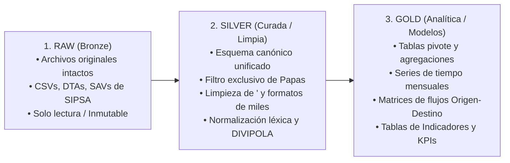
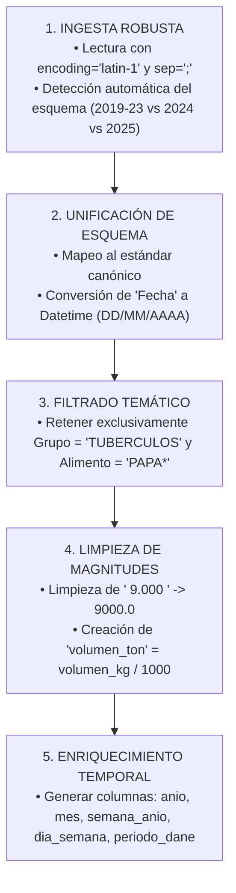

# Manual de Formateo, Data Wrangling, Pivoteo y Gobernanza de Datos

**Proyecto**: Análisis Histórico del Mercado de la Papa en Colombia (2019 - 2025)  
**Marco Normativo**: DAMA-BOK (Data Governance, Data Quality, Master Data & Analytics)  
**Estándar de Código**: Clean Code y PEP 8  

---

## 1. Marco de Gobernanza de Datos (DAMA-BOK)

Para garantizar la máxima integridad, trazabilidad y rigor analítico, el manejo de datos del mercado de la papa se rige por las **6 Dimensiones Universales de Calidad de Datos**:

```
┌────────────────────────────────────────────────────────────────────────┐
│             DIMENSIONES DE CALIDAD DE DATOS (DAMA-BOK)                 │
├─────────────────┬──────────────────────────────────────────────────────┤
│ DIMENSIÓN       │ CRITERIO OPERACIONAL EN EL PROYECTO PAPA             │
├─────────────────┼──────────────────────────────────────────────────────┤
│ 1. Completitud  │ 0% de nulos en variables clave (Fecha, Variedad, Kg) │
│ 2. Validez      │ Códigos DIVIPOLA válidos según catálogo DANE oficial │
│ 3. Consistencia │ Suma de volúmenes por variedad = volumen total mes    │
│ 4. Exactitud    │ Volúmenes positivos coincidentes con capacidad carga │
│ 5. Unicidad     │ Eliminación de duplicados de encuesta idénticos      │
│ 6. Trazabilidad │ Linaje explícito: Raw (Bronze) → Silver → Gold       │
└─────────────────┴──────────────────────────────────────────────────────┘
```

### Arquitectura de Linaje de Datos (Medallion Pattern)


---

## 2. Manual de Formateo y Estandarización Léxica

### 2.1 Estandarización de Variedades de Papa
Los registros crudos presentan inconsistencias tipográficas entre periodos. Se aplica un **Diccionario de Mapeo Canónico**:

| Texto Crudo en SIPSA | Denominación Canónica Estandarizada | Familia / Segmento |
|---|---|---|
| `Papa suprema`, `PAPA SUPREMA`, `Papa Suprema` | **Papa Suprema** | Consumo en Fresco (Mesa) |
| `Papa pastusa`, `PAPA PASTUSA`, `Papa Pastusa` | **Papa Pastusa** | Consumo en Fresco (Mesa) |
| `Papa diacol capiro`, `Papa capiro`, `Papa capira`, `PAPA CAPIRO` | **Papa Diacol Capiro (Capira)** | Industrial / Fritura |
| `Papa criolla limpia`, `Papa criolla`, `Papa criolla sucia` | **Papa Criolla** | Variedad Especial / Amarilla |
| `Papa r-12 negra`, `Papa r-12`, `Papa parda pastusa` | **Papa R-12 / Negra** | Consumo en Fresco (Mesa) |
| `Papa sabanera`, `Papa tuquerreña`, `Papa rubi`, `Papa betina` | **Otras Papas de Mesa** | Consumo en Fresco (Mesa) |

### 2.2 Normalización de Mercados Mayoristas
| Texto Crudo en SIPSA | Denominación Canónica | Ciudad Principal |
|---|---|---|
| `Bogotá, D.C., Corabastos`, `Corabastos` | **Corabastos** | Bogotá D.C. |
| `Cali, Cavasa`, `Cavasa` | **Cavasa** | Cali (Valle) |
| `Medellín, Central Mayorista de Antioquia`, `Itagüí, Mayorista` | **Central Mayorista de Antioquia** | Medellín (Antioquia) |
| `Armenia, Mercar`, `Mercar` | **Mercar** | Armenia (Quindío) |
| `Pereira, Mercasa` | **Mercasa** | Pereira (Risaralda) |
| `Bucaramanga, Centroabastos` | **Centroabastos** | Bucaramanga (Santander) |

### 2.3 Tratamiento de Códigos DIVIPOLA
- Regla: Extraer solo los caracteres numéricos y rellenar con ceros a la izquierda si procede:
  - `depto_code = cod_depto.str.extract(r'(\d+)')[0].str.zfill(2)`
  - `mpio_code = cod_mpio.str.extract(r'(\d+)')[0].str.zfill(5)`

---

## 3. Procedimiento de Data Wrangling

El flujo funcional de preparación de datos se ejecuta en 5 etapas secuenciales:



---

## 4. Manual de Pivoteo y Agregaciones Multidimensionales

El análisis analítico de mercado requiere reestructurar los microdatos transaccionales (filas por camión/encuesta) en **matrices pivote bidimensionales**:

### 4.1 Pivoteo 1: Matriz Temporal $\times$ Variedades (Dinámica de Oferta)
- **Filas**: `anio` y `mes`.
- **Columnas**: `variedad_papa` (Pastusa, Capiro, Suprema, Criolla, R-12).
- **Valores**: $\sum \text{volumen\_ton}$.
- **Propósito**: Observar la evolución temporal de cada variedad e identificar cambios en la canasta de mercado.

### 4.2 Pivoteo 2: Matriz Origen $\times$ Destino (Flujos Logísticos de Carga)
- **Filas**: `depto_origen` (Cundinamarca, Boyacá, Nariño, Antioquia, Santander).
- **Columnas**: `mercado_mayorista` (Corabastos, Cavasa, Mayorista Antioquia, Mercar).
- **Valores**: $\sum \text{volumen\_ton}$ y $\%$ de participación.
- **Propósito**: Mapear la matriz insumo-producto espacial y evaluar la vulnerabilidad de cada plaza.

### 4.3 Pivoteo 3: Matriz de Estacionalidad Anual (Para el Cálculo del IEO)
- **Filas**: `mes` (1 a 12).
- **Columnas**: `anio` (2019, 2020, 2021, 2022, 2023, 2024, 2025).
- **Valores**: $\text{volumen\_ton}$ total del mes.
- **Propósito**: Calcular los promedios mensuales históricos que alimentan el Índice de Estacionalidad ($\text{IEO}$, base 100).

### 4.4 Pivoteo 4: Matriz de Segmentos Comerciales
- **Filas**: `anio`.
- **Columnas**: `segmento_consumo` (Fresco / Mesa vs. Industrial / Fritura vs. Papa Criolla).
- **Valores**: $\%$ Cuota de mercado.
- **Propósito**: Contrastar el crecimiento del segmento agroindustrial frente al consumo hogareño tradicional.

### 4.5 Pivoteo 5: Matriz Desagregada Municipal $\times$ Mes (Estacionalidad Microterritorial)
- **Filas**: `depto_origen` y `municipio_origen` (con código DIVIPOLA).
- **Columnas**: `mes` (1 a 12).
- **Valores**: $\sum \text{volumen\_ton}$.
- **Propósito**: Determinar en qué meses específicos despacha cada municipio productor (identificando la sincronía de cosechas a nivel micro).

### 4.6 Pivoteo 6: Matriz de Precios Mayoristas Variedad $\times$ Plaza
- **Filas**: `variedad_papa`.
- **Columnas**: `mercado_mayorista` (Corabastos, Cavasa, Mayorista Antioquia, Mercar).
- **Valores**: Mediana y Media ponderada de precio ($COP/Kg$).
- **Propósito**: Cuantificar las brechas espaciales de precio (primas de flete y concentración de consumo).

---

## 5. Reglas de Calidad y Rigor Operacional

1. **Inmutabilidad de la Capa Raw**: Nunca se modifica, sobreescribe ni renombra ningún archivo dentro de `data/RAW/sipsa/`.
2. **Determinismo y Reproducibilidad**: Cualquier paso de imputación o remoción de duplicados debe estar gobernado por una semilla fija o criterio explícito documentado.
3. **Validación de Balances de Masa**:
   $$\sum \text{Volumen Tablas Pivote} \equiv \sum \text{Volumen Capa Silver Limpia}$$
   Ningún kilogramo de papa puede crearse o destruirse durante los procesos de transformación y pivoteo.
