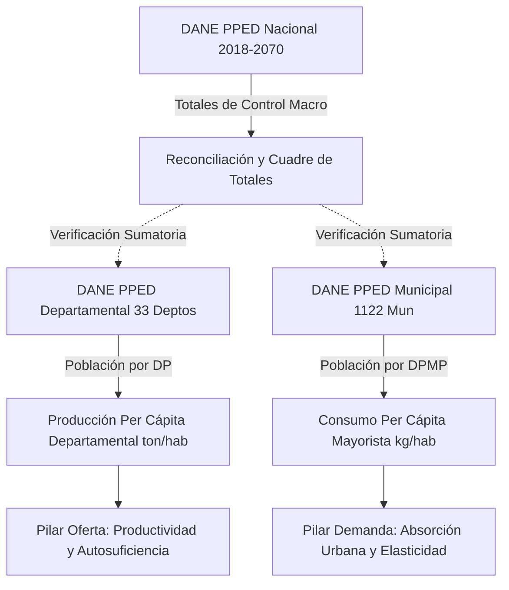
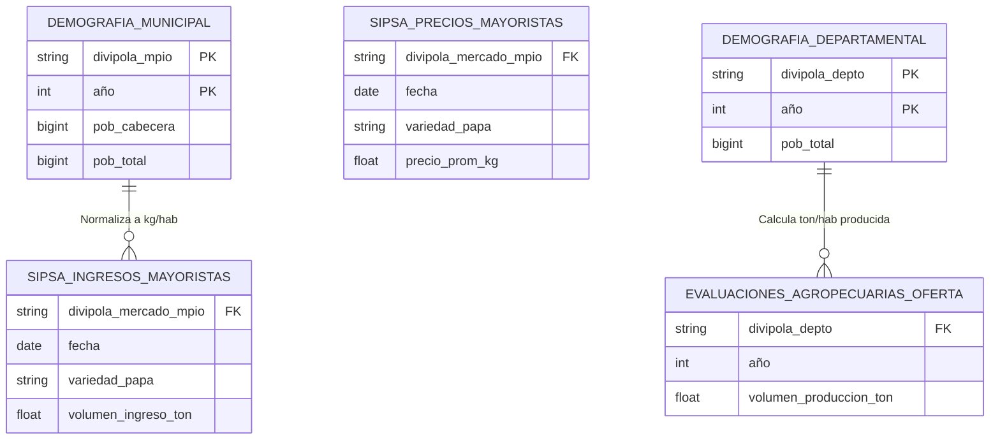

# Plan de Extracción y Desagregación Demográfica por DIVIPOLA (2019–2025)

**Proyecto**: Análisis Crítico del Mercado de la Papa en Colombia (SIPSA 2019–2025)  
**Documento**: Metodología y Plan de Ingeniería de Datos Demográficos  
**Fase PDCO**: PLAN → DEVELOPMENT  
**Fuente Base**: DANE — Proyecciones de Población y Estudios Demográficos (PPED)  
**Ruta del Archivo Fuente**: [data/RAW/demografía/PPED-AreaNac-2018-2070.xlsx](file:///c:/Users/ADAN/OneDrive/Documentos/analisispapamercadoorlando/data/RAW/demograf%C3%ADa/PPED-AreaNac-2018-2070.xlsx)

---

## 1. Diagnóstico y Estado Actual del Insumo Demográfico

### 1.1 Estructura del Archivo Disponible
La carpeta `data/RAW/demografía/` contiene actualmente el archivo oficial de actualización postcensal DANE publicado el 18 de julio de 2025:
* **Archivo**: `PPED-AreaNac-2018-2070.xlsx`
* **Hojas**:
  1. `Índice`: Metadatos institucionales de la Dirección Técnica de Censos y Demografía (DCD).
  2. `PPED`: Nota metodológica sobre el modelo de componentes de cohortes adaptado multirregional.
  3. `PobNacionalxárea`: Tabla longitudinal con proyecciones anuales desagregadas por área geográfica:
     * `Cabecera`: Población urbana residente en cabeceras municipales.
     * `Centros Poblados y Rural Disperso`: Población rural de corregimientos, veredas y campo disperso.
     * `Total`: Agregado nacional consolidado ($N_{\text{Nac}} = N_{\text{Cabecera}} + N_{\text{Rural}}$).

### 1.2 Línea Base Nacional Extraída (2018–2026)
La extracción analítica directa del archivo confirma los siguientes denominadores macro-poblacionales oficiales para el periodo de estudio del mercado de la papa:

| Año ($t$) | Cabecera ($N_{\text{Cab}, t}$) | Rural Disperso ($N_{\text{Rur}, t}$) | Total Nacional ($N_{\text{Nac}, t}$) | Participación Cabecera (%) |
|:---:|:---:|:---:|:---:|:---:|
| **2018** | 36,414,521 | 11,843,973 | 48,258,494 | 75.46% |
| **2019** | 37,219,289 | 12,047,237 | 49,266,526 | 75.55% |
| **2020** | 38,130,362 | 12,260,428 | 50,390,790 | 75.67% |
| **2021** | 38,710,371 | 12,405,266 | 51,115,637 | 75.73% |
| **2022** | 39,130,235 | 12,513,330 | 51,643,565 | 75.77% |
| **2023** | 39,507,801 | 12,609,266 | 52,117,067 | 75.81% |
| **2024** | 39,903,699 | 12,710,054 | 52,613,753 | 75.84% |
| **2025** | 40,257,670 | 12,799,542 | 53,057,212 | 75.88% |
| **2026** | 40,529,928 | 12,869,243 | 53,399,171 | 75.90% |

> **Observación Metodológica**: Este archivo provee el ancla macro-demográfica nacional. Sin embargo, para computar el **Consumo Per Cápita Municipal** ($c_{m,t}$) en ciudades mayoristas y la **Producción Per Cápita Departamental** ($q_{d,t}$) en cuencas paperas, se requiere la serie desagregada a nivel de código DIVIPOLA DANE (`DP` de 2 dígitos y `DPMP` de 5 dígitos).

---

## 2. Marco Conceptual: Jerarquía Demográfica y Acople con SIPSA

Para el análisis de los tres pilares del mercado (Oferta, Demanda y Precios), la desagregación poblacional cumple un rol de normalización econométrica:



### 2.1 Ecuaciones de Integración Agro-Demográfica

1. **Producción Per Cápita Departamental ($q_{d,t}$)**:
   $$q_{d,t} = \frac{Q_{d,t}}{N_{d,t}} \quad [\text{toneladas / habitante}]$$
   *Donde $Q_{d,t}$ es el volumen total producido en el departamento $d$ durante el año $t$, y $N_{d,t}$ es la población total del departamento según código DIVIPOLA $d$.*

2. **Consumo Aparente Per Cápita de Nodo Urbano Mayorista ($c_{m,t}$)**:
   $$c_{m,t} = \frac{I_{m,t} - S_{m,t}}{N_{\text{Cab}, m, t}} \times 1000 \quad [\text{kg / habitante}]$$
   *Donde $I_{m,t}$ son los ingresos mayoristas a la central del municipio $m$, $S_{m,t}$ son las salidas o reexpediciones a otros municipios, y $N_{\text{Cab}, m, t}$ es la población de la cabecera municipal (área urbana de influencia inmediata del mercado).*

---

## 3. Plan Operativo de Extracción y Desagregación

El plan se estructura en 4 fases secuenciales:

```
┌────────────────────────────────────────────────────────────────────────┐
│                   PIPELINE DE EXTRACCIÓN DEMOGRÁFICA                   │
├───────────────────┬───────────────────┬────────────────────────────────┤
│ FASE 1: INGESTIÓN │ FASE 2: DESCARGA  │ FASE 3: WRANGLING & MERGE      │
│   Y FILTRADO NAC  │   SERIES DIVIPOLA │ FASE 4: EXPORTACIÓN PARQUET    │
└───────────────────┴───────────────────┴────────────────────────────────┘
```

### Fase 1: Extracción del Archivo Local `PPED-AreaNac-2018-2070.xlsx`
* **Acción**: Automatizar la lectura mediante `pandas` / `openpyxl`.
* **Transformación**:
  1. Omitir metadatos de las primeras 4 filas de la hoja `PobNacionalxárea`.
  2. Filtrar únicamente los años de interés del estudio: $t \in [2019, 2025]$.
  3. Pivotear la columna `ÁREA GEOGRÁFICA` a columnas individuales: `pob_cabecera_nac`, `pob_rural_nac`, `pob_total_nac`.
  4. Asignar el código canónico de DIVIPOLA Nacional: `divipola_depto = '00'`, `nombre_depto = 'TOTAL NACIONAL'`.
  5. Exportar a capa estructurada: `data/PROCESSED/demografia/demografia_nacional_2019_2025.parquet`.

### Fase 2: Protocolo de Incorporación de Series Desagregadas por DIVIPOLA
Para completar la granularidad departamental y municipal, el DANE publica de forma abierta los archivos hermanos del paquete PPED:
1. **Serie Departamental**: `PPED-Dep-2018-2050.xlsx` (o `DCD-area-sexo-edad-proypob-dep-2020-2050.xlsx`).
   * Contiene la población de los 33 departamentos (códigos 05 a 99) desglosada por Cabecera, Rural y Total por año.
2. **Serie Municipal**: `PPED-Mun-2018-2035.xlsx` (o `DCD-area-sexo-edad-proypob-mun-2020-2035.xlsx`).
   * Contiene los 1,122 municipios de Colombia con su código `DPMP` de 5 dígitos, desagregados anualmente.

#### Fuentes Oficiales de Descarga DANE:
* **Portal DANE**: `https://www.dane.gov.co/index.php/estadisticas-por-tema/demografia-y-poblacion/proyecciones-de-poblacion`
* **Repositorio de Microdatos / Datos Abiertos**: `https://www.datos.gov.co/` (Conjunto: Proyecciones de población municipal por área).
* **Ubicación de Destino en el Proyecto**:
  * `data/RAW/demografía/PPED-Dep-2018-2050.xlsx`
  * `data/RAW/demografía/PPED-Mun-2018-2035.xlsx`

### Fase 3: Reglas de Transformación, Normalización y Cuadre (Wrangling)

1. **Normalización de Llaves DIVIPOLA**:
   * Forzar tipo `string` (texto) para evitar pérdida del cero a la izquierda.
   * `divipola_depto`: Formatear con `.str.zfill(2)` (ej. `'5'` $\rightarrow$ `'05'`).
   * `divipola_municipio`: Formatear con `.str.zfill(5)` (ej. `'5001'` $\rightarrow$ `'05001'`).
2. **Homogenización Lexicográfica**:
   * Convertir nombres a mayúsculas sostenidas, eliminando tildes y caracteres especiales con codificación UTF-8.
   * Mapear discrepancias históricas (ej. `'BOGOTA D.C.'` $\rightarrow$ `'BOGOTÁ, D.C.'`, `'SAN ANDRES'` $\rightarrow$ `'ARCHIPIÉLAGO DE SAN ANDRÉS, PROVIDENCIA Y SANTA CATALINA'`).
3. **Consistencia y Balance Poblacional (Audit Balance)**:
   * Para cada año $t \in [2019, 2025]$ y departamento $d$:
     $$\sum_{m \in d} N_{m, t} = N_{d, t}$$
   * Para cada año $t$:
     $$\sum_{d=1}^{33} N_{d, t} = N_{\text{Nac}, t}$$
   * Si la diferencia residual absoluta supera el 0.001% (debido a redondeos de cohortes en DANE), aplicar ajuste de cierre al departamento de residencia dispersa o registrar nota de discrepancia por método censal.

---

## 4. Especificación del Script ETL de Extracción (`scripts/extract_demografia.py`)

A continuación se detalla la lógica formal de extracción en Python para ejecutar en el entorno del proyecto:

```python
"""
MÓDULO: extract_demografia.py
OBJETIVO: Extraer y estandarizar datos demográficos DANE 2019-2025 por DIVIPOLA.
ESTÁNDAR: PEP 8, DAMA-BOK, ISO/IEC 25010.
"""

from pathlib import Path
import pandas as pd
import numpy as np

RAW_DEMO_DIR = Path("data/RAW/demografía")
PROC_DEMO_DIR = Path("data/PROCESSED/demografia")
PROC_DEMO_DIR.mkdir(parents=True, exist_ok=True)

YEARS_SCOPE = list(range(2019, 2026))


def extraer_demografia_nacional() -> pd.DataFrame:
    """Extrae las proyecciones nacionales 2019-2025 desde PPED-AreaNac-2018-2070.xlsx."""
    file_path = RAW_DEMO_DIR / "PPED-AreaNac-2018-2070.xlsx"
    if not file_path.exists():
        raise FileNotFoundError(f"Archivo no encontrado: {file_path}")

    # Leer hoja PobNacionalxárea omitiendo encabezados de presentación
    df_raw = pd.read_excel(
        file_path,
        sheet_name="PobNacionalxárea",
        skiprows=4,
        header=0
    )
    
    # Renombrar columnas canónicas
    df_raw.columns = ["territorio", "año", "area_geografica", "poblacion"]
    
    # Filtrar años del estudio y limpiar nulos
    df = df_raw.dropna(subset=["año", "poblacion"]).copy()
    df["año"] = df["año"].astype(int)
    df = df[df["año"].isin(YEARS_SCOPE)].copy()
    
    # Pivotear áreas a columnas
    df_piv = df.pivot(index=["territorio", "año"], columns="area_geografica", values="poblacion").reset_index()
    
    df_piv = df_piv.rename(columns={
        "Cabecera": "pob_cabecera",
        "Centros Poblados y Rural Disperso": "pob_rural",
        "Total": "pob_total"
    })
    
    # Atributos de enlace DIVIPOLA
    df_piv["divipola_depto"] = "00"
    df_piv["nombre_depto"] = "TOTAL NACIONAL"
    
    # Reordenar columnas canónicas
    cols_order = ["año", "divipola_depto", "nombre_depto", "pob_cabecera", "pob_rural", "pob_total"]
    df_final = df_piv[cols_order].sort_values("año").reset_index(drop=True)
    
    # Guardar en Parquet y CSV
    out_parquet = PROC_DEMO_DIR / "demografia_nacional_2019_2025.parquet"
    df_final.to_parquet(out_parquet, index=False)
    df_final.to_csv(PROC_DEMO_DIR / "demografia_nacional_2019_2025.csv", index=False)
    
    print(f"Demografía nacional extraída exitosamente: {out_parquet} ({len(df_final)} filas)")
    return df_final


def extraer_demografia_departamental_municipal(archivo_fuente: Path, nivel: str) -> pd.DataFrame:
    """
    Lee y estructura la serie departamental o municipal de proyecciones DANE.
    nivel: 'depto' o 'municipio'
    """
    if not archivo_fuente.exists():
        print(f"ADVERTENCIA: Archivo {archivo_fuente} pendiente de descarga desde portal DANE.")
        return pd.DataFrame()

    df = pd.read_excel(archivo_fuente, skiprows=4)
    # Formateo de DIVIPOLA con ceros a la izquierda
    if nivel == "depto":
        df["divipola_depto"] = df["DP"].astype(str).str.zfill(2)
        cols_id = ["divipola_depto", "DPNOM"]
    else:
        df["divipola_depto"] = df["DP"].astype(str).str.zfill(2)
        df["divipola_mpio"] = df["DPMP"].astype(str).str.zfill(5)
        cols_id = ["divipola_depto", "divipola_mpio", "MPNOM"]

    # Melt de columnas de años si vienen en formato ancho (AÑO_2019, ..., AÑO_2025)
    # ...
    return df


if __name__ == "__main__":
    extraer_demografia_nacional()
```

---

## 5. Esquemas de Datos Canónicos para la Demografía Procesada

Para garantizar el estándar DAMA-BOK en la capa analítica procesada (`data/PROCESSED/`), se establecen los siguientes esquemas de salida:

### 5.1 Tabla: `demografia_anual_nacional`
| Columna | Tipo de Dato | Nullable | Restricción / Formato | Descripción |
|:---|:---:|:---:|:---:|:---|
| `año` | `INT16` | NO | $2019 \le \text{año} \le 2025$ | Año calendario de proyección |
| `divipola_depto` | `STRING` | NO | `'00'` | Código ficticio nacional |
| `nombre_depto` | `STRING` | NO | `'TOTAL NACIONAL'` | Nombre geográfico consolidado |
| `pob_cabecera` | `INT64` | NO | $> 0$ | Habitantes en cabeceras urbanas |
| `pob_rural` | `INT64` | NO | $> 0$ | Habitantes en centros poblados y rural |
| `pob_total` | `INT64` | NO | `pob_cabecera + pob_rural` | Población nacional residente total |

### 5.2 Tabla: `demografia_anual_departamental`
| Columna | Tipo de Dato | Nullable | Restricción / Formato | Descripción |
|:---|:---:|:---:|:---:|:---|
| `año` | `INT16` | NO | $2019 \le \text{año} \le 2025$ | Año calendario de proyección |
| `divipola_depto` | `STRING` | NO | Regex `^[0-9]{2}$` | Código DIVIPOLA de 2 dígitos |
| `nombre_depto` | `STRING` | NO | Mayúsculas sin tilde | Nombre oficial DANE del departamento |
| `pob_cabecera` | `INT64` | NO | $> 0$ | Población urbana departamental |
| `pob_rural` | `INT64` | NO | $> 0$ | Población rural departamental |
| `pob_total` | `INT64` | NO | `pob_cabecera + pob_rural` | Total habitantes del departamento |
| `pct_part_nacional` | `FLOAT64` | NO | $0 \le x \le 100$ | Participación % sobre la población nacional |

### 5.3 Tabla: `demografia_anual_municipal`
| Columna | Tipo de Dato | Nullable | Restricción / Formato | Descripción |
|:---|:---:|:---:|:---:|:---|
| `año` | `INT16` | NO | $2019 \le \text{año} \le 2025$ | Año calendario de proyección |
| `divipola_depto` | `STRING` | NO | Regex `^[0-9]{2}$` | Código del departamento padre |
| `divipola_mpio` | `STRING` | NO | Regex `^[0-9]{5}$` | Código DIVIPOLA de 5 dígitos |
| `nombre_mpio` | `STRING` | NO | Mayúsculas sin tilde | Nombre oficial DANE del municipio |
| `pob_cabecera` | `INT64` | NO | $> 0$ | Población urbana de cabecera |
| `pob_rural` | `INT64` | NO | $\ge 0$ | Población rural del municipio |
| `pob_total` | `INT64` | NO | `pob_cabecera + pob_rural` | Población municipal consolidada |
| `es_cuenca_papera` | `BOOLEAN` | NO | `True` / `False` | Indicador si es municipio productor de papa |
| `es_nodo_mayorista` | `BOOLEAN` | NO | `True` / `False` | Indicador si alberga central de abastos SIPSA |

---

## 6. Acople Analítico con los Datos de Precios y Volúmenes de Papa

Una vez procesada la tabla demográfica, el cruce con las bases de SIPSA se efectúa bajo el siguiente protocolo de enlace relacional:



### Reglas de Cruce:
1. **Población Cabecera vs Población Total**:
   * En centrales de abastos situadas en grandes áreas metropolitanas (ej. Bogotá D.C. `11001`, Medellín `05001`, Cali `76001`), se debe usar la **Población del Área Metropolitana** o la población de cabecera como denominador principal para el consumo, dado que las compras mayoristas abastecen a los conglomerados conurbanos.
2. **Consumo Aparente Mensual y Anual**:
   * Para calcular el consumo mensual $c_{m, k, t}$ (mes $k$), se utiliza la población anual estimada $N_{m, t}$ como denominador estable, dividiendo el consumo mensual por dicha masa poblacional para evitar distorsiones por estacionalidad demográfica interanual.
3. **Manejo de Errores de Cruce**:
   * Cualquier registro de SIPSA cuyo código municipal no coincida con el catálogo oficial DIVIPOLA generará una alerta de calidad de datos (`Flag_DIVIPOLA_Mismatch`) y se someterá a resolución mediante el diccionario de sinonimias del catálogo maestro.
