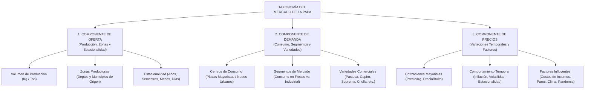

# Taxonomía de los Datos del Mercado de la Papa

**Proyecto**: Análisis Histórico del Mercado de la Papa en Colombia (2019 - 2025)  
**Fuente**: SIPSA - DANE (Abastecimiento y Precios Agropecuarios)  
**Estructura**: Clasificación taxonómica organizada en los tres pilares del estudio: **Oferta**, **Demanda** y **Precios/Factores Influyentes**.

---

## 1. Estructura Taxonómica General



---

## 2. Clasificación Detallada por Componente

### 2.1 Componente de Oferta (Producción, Zonas Productoras y Estacionalidad)

| Categoría | Variable Analítica | Variable Original SIPSA | Escala / Tipo | Valores o Descripción |
|-----------|--------------------|-------------------------|---------------|-----------------------|
| **Producción Físico** | `volumen_ofertado_kg` | `Cant Kg` | Razón continua | Kilogramos brutos despachados hacia el mercado. |
| **Producción Agregada**| `volumen_ofertado_ton`| Derivada ($\text{Kg}/1000$) | Razón continua | Toneladas métricas despachadas. |
| **Zonas: Departamento**| `depto_origen` | `Departamento Proc.` | Nominal | Nombre del departamento productor (Cundinamarca, Boyacá, Nariño, Antioquia, Santander, etc.). |
| **Zonas: Código Depto**| `cod_depto_origen` | `Cod. Depto Proc.` | Nominal / Código | Código oficial DANE (ej. 15 = Boyacá, 25 = Cundinamarca, 52 = Nariño). |
| **Zonas: Municipio** | `municipio_origen` | `Municipio Proc.` | Nominal | Municipio del predio o centro de acopio de origen. |
| **Zonas: Código Mpio** | `cod_mpio_origen` | `Cod. Municipio Proc.`| Nominal / DIVIPOLA | Código municipal DIVIPOLA de 5 dígitos. |
| **Estacionalidad: Año** | `anio` | Derivada de fecha | Ordinal / Discreta | 2019, 2020, 2021, 2022, 2023, 2024, 2025. |
| **Estacionalidad: Periodo** | `periodo_reporte` | Carpeta / Archivo | Ordinal | Semestre I/II (2019-2023) o Cuatrimestre I/II/III (2024-2025). |
| **Estacionalidad: Mes** | `mes` | Derivada de fecha | Ordinal / Cíclica | 1 a 12 (Enero a Diciembre). Base para el Índice de Estacionalidad (IEO). |
| **Estacionalidad: Semana**| `semana_anio` | Derivada de fecha | Discreta (1 a 52) | Semana del año para análisis de granularidad media y choques puntuales. |
| **Estacionalidad: Fecha**| `fecha_encuesta` | `FechaEncuesta` | Temporal | Nivel diario atómico de levantamiento de encuesta en plaza. |
| **Periodo de Producción**| `ciclo_agronomico` | Derivada de variedad | Nominal / Temporal | - **Ciclo Largo (Papa de año)**: 150–180 días (2 cosechas/año)<br>- **Ciclo Corto (Papa criolla)**: 105–120 días (3 cosechas/año) |
| **Índice Estacionalidad** | `indice_estacionalidad_oferta`| Derivada estadística | Razón porcentual | Valor base 100 por mes calendario para aislar picos y valles de cosecha. |
| **Producción per-cápita** | `produccion_per_capita_kg` / `_ton` | Derivada (`VTO / Población`) | Razón continua | Masa producida por habitante al año (Nacional y Departamental). |

---

### 2.2 Componente de Demanda (Consumo, Segmentos y Variedades)

| Categoría | Variable Analítica | Variable Original SIPSA | Escala / Tipo | Valores o Descripción |
|-----------|--------------------|-------------------------|---------------|-----------------------|
| **Nodo de Consumo** | `plaza_mayorista` | `Fuente` | Nominal | Central mayorista receptora (Corabastos, Cavasa, Mayorista Antioquia, Mercar, etc.). |
| **Ciudad Destino** | `ciudad_consumo` | Derivada de `Fuente` | Nominal | Ciudad principal abastecida (Bogotá, Cali, Medellín, Armenia, Bucaramanga, etc.). |
| **Segmento de Mercado** | `segmento_consumo` | Derivada de variedad | Categórica | - **Consumo en Fresco (Mesa)**<br>- **Industrial (Procesamiento/Fritura)**<br>- **Especial (Papa Criolla)** |
| **Variedad Comercial** | `variedad_papa` | `Ali` | Nominal | Denominación comercial en mercado (Papa Pastusa, Diacol Capiro, Suprema, Criolla, R-12, etc.). |
| **Volumen Absorbido** | `volumen_demandado_ton` | Agregación por plaza | Razón continua | Toneladas totales absorbidas por una plaza específica en un periodo. |
| **Participación Variedad**| `cuota_mercado_variedad` | Derivada (%) | Razón porcentual | Porcentaje que representa una variedad sobre la demanda total de papa. |
| **Demanda Aparente** | `demanda_aparente_ton` / `_kg` | Derivada agregada | Razón continua | Volumen total neto de papa disponible para el consumo nacional en Ton o Kg. |
| **Población Colombia** | `poblacion_colombia` | DANE (Proyecciones CNPV) | Discreta | Número oficial de habitantes proyectados para el año analizado. |
| **Consumo per-cápita (Ton)**| `consumo_per_capita_ton` | Derivada (`DA / Población`) | Razón continua | Consumo promedio de papa en toneladas por habitante al año. |
| **Consumo per-cápita (Kg)** | `consumo_per_capita_kg` | Derivada (`DA_kg / Población`) | Razón continua | Ingesta media anual en kilogramos por habitante (35 a 60 kg/hab/año). |

---

### 2.3 Componente de Precios y Factores Influyentes

| Categoría | Variable Analítica | Variable SIPSA Precios | Escala / Tipo | Valores o Descripción |
|-----------|--------------------|------------------------|---------------|-----------------------|
| **Precio Unitario** | `precio_promedio_kg` | `Precio Promedio` | Razón continua | Precio en pesos colombianos (COP) por kilogramo al por mayor. |
| **Precio por Bulto** | `precio_bulto_50kg` | Derivada ($\text{Precio/Kg} \times 50$) | Razón continua | Cotización de la presentación estándar de 50 kg en plaza mayorista. |
| **Rango de Precios** | `precio_minimo`, `precio_maximo` | `Precio Min`, `Precio Max` | Razón continua | Banda de cotización observada en la jornada de mercado. |
| **Volatilidad Temporal**| `coeficiente_variacion_precio`| Calculada estadísticamente | Porcentaje (%) | Desviación estándar / Media de precios en el periodo. |
| **Factor: Insumos** | `periodo_crisis_fertilizantes`| Variable contextual | Dicotómica | Periodo 2022–2023 (choque de precios de urea y fertilizantes importados). |
| **Factor: Logística** | `evento_bloqueo_vial` | Variable contextual | Dicotómica | Mayo-Junio 2021 (interrupción de corredores viales clave hacia el suroccidente y centro). |
| **Factor: Movilidad** | `periodo_pandemia_covid` | Variable contextual | Dicotómica | 2020 (restricciones de cuarentena y choque en canal HORECA). |
| **Factor: Clima** | `anomalia_climatica` | Variable contextual | Categórica | Eventos de El Niño (sequías/heladas) o La Niña (exceso de lluvias). |

---

## 3. Taxonomía de las Variedades Comerciales de Papa

La clasificación comercial del producto en el mercado colombiano se organiza en tres grandes familias según su aptitud de uso y demanda:

```
PAPA (Solanum tuberosum / Solanum phureja)
│
├── 1. Papas de Mesa (Consumo en Fresco / Hogares)
│   ├── Papa Pastusa: Tradicional, textura suave/arenosa, preferida en sopas y purés.
│   ├── Papa Suprema: Alta productividad, piel blanca, resistente, consumo masivo.
│   ├── Papa R-12 / Negra: Piel oscura, pulpa firme, uso culinario diverso.
│   ├── Papa Betina / Rubí / Tuquerreña: Variedades regionales complementarias.
│   └── Papa Sabanera: Piel morada/oscura, textura firme, uso en cocidos y ensaladas.
│
├── 2. Papas de Uso Agroindustrial (Fritura y Procesamiento)
│   ├── Papa Diacol Capiro (Capira): Variedad reina de la industria, alto contenido de materia seca, apta para papas a la francesa y chips.
│   └── Papa Única: Variedad de buen comportamiento industrial y de mesa.
│
└── 3. Papas Criollas (Papa Amarilla - Solanum phureja)
    ├── Papa Criolla Limpia: Lavada y seleccionada, cotización superior.
    └── Papa Criolla Sucia / Común: Comercializada directamente con tierra de cosecha.
```

---

## 4. Matriz de Integración de los Tres Componentes

```
┌────────────────────────────────────────────────────────────────────────┐
│               INTEGRACIÓN EN EL ANÁLISIS DE MERCADO                    │
├────────────────────┬────────────────────┬──────────────────────────────┤
│ 1. OFERTA          │ 2. DEMANDA         │ 3. PRECIOS                   │
│                    │                    │                              │
│ Origen: Cuencas    │ Destino: Plazas    │ Cotización de Equilibrio:    │
│ Productores        │ Consumidores       │ Formación en Plaza           │
│                    │                    │                              │
│ Cundinamarca,      │ Corabastos,        │ • Relación inversa con el    │
│ Boyacá, Nariño,    │ Cavasa, Medellín,  │   volumen ofertado           │
│ Antioquia          │ Mercar             │ • Primas según variedad      │
│                    │                    │ • Sobrecostos por fletes     │
│ [Volumen Ofertado] │ [Volumen Absorbido]│   y choques exógenos         │
└────────────────────┴────────────────────┴──────────────────────────────┘
```

---

## 5. Matriz de Jerarquías y Niveles de Desagregación Analítica

Para responder preguntas de investigación a diferentes escalas de decisión, se formalizan cuatro dimensiones jerárquicas de desagregación:

| Dimensión de Desagregación | Nivel 1 (Macro) | Nivel 2 (Meso) | Nivel 3 (Micro) | Nivel 4 (Atómico) |
|---|---|---|---|---|
| **Geográfica (Origen)** | País (Colombia) | Departamento (e.g. Cundinamarca, Nariño) | Municipio DIVIPOLA (e.g. Túquerres, Villapinzón) | Vereda / Predio de Acopio (si disponible) |
| **Geográfica (Destino)**| Red Nacional Mayorista | Región de Consumo (Centro, Suroccidente, Antioquia) | Central de Abasto (Corabastos, Cavasa, Mayorista Antioquia, Mercar) | Puesto / Bodega de Plaza |
| **Logística (Flujo)** | Total País | Corredor Interdepartamental (Nariño $\rightarrow$ Valle) | Ruta Municipal $\rightarrow$ Plaza (Ipiales $\rightarrow$ Cavasa) | Despacho individual (Camión / Furgón) |
| **Producto (Oferta/Demanda)**| Tubérculos | Subgrupo Papas | Segmento de Uso (Fresco vs. Industrial vs. Criolla) | Variedad Comercial (Pastusa, Capiro, Suprema, etc.) |
| **Temporal (Cronológica)**| Septenio (2019–2025) | Año Calendario | Periodo DANE (Semestre / Cuatrimestre) | Mes $\rightarrow$ Semana $\rightarrow$ Día de Encuesta |

### Regla Metodológica de Desagregación (Drill-Down / Roll-Up):
1. **Roll-Up (Agregación Ascendente)**: Toda métrica macro (e.g., Demanda Aparente Nacional) debe ser la suma exacta de sus partes desagregadas sin pérdidas de masa.
2. **Drill-Down (Desagregación Descendente)**: Todo análisis de anomalía o inferencia debe permitir profundizar desde el total nacional hasta la combinación atómica `(Año, Mes, Variedad, Origen, Destino)` para aislar la causa raíz del fenómeno de mercado.
